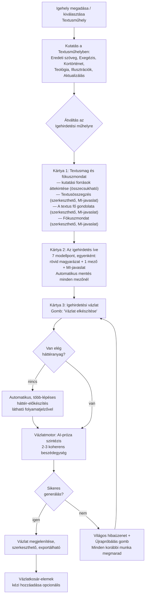
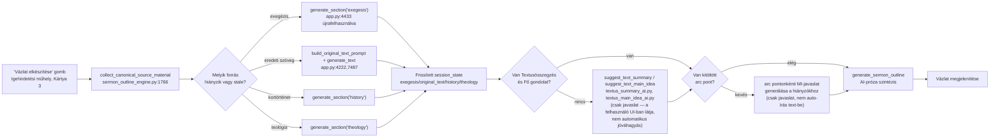

# Textus — egyszerűsített igehirdetés-előkészítési célarchitektúra-terv

Ág: `refactor/two-workshop-flow` · Dátum: 2026-08-13 · **Ez a dokumentum kizárólag terv. Nem történt kódmódosítás, hibajavítás, refaktor vagy commit.**

Alapja: `TEXTUS_TELJES_IGEHIRDETÉSI_ARCHITEKTÚRA_AUDIT_2026-08-13.md` + a jelen körben kapott, rögzített termékdöntések + a tényleges kód közvetlen újraellenőrzése (`textus_workshop_data.py`, `sermon_workshop_data.py` teljes adatséma, `sermon_outline_engine.py` kulcshalmazai és fő belépési pontjai, `sermon_workshop_outline_ai.py` orkesztráció, `app.py` autosave). A kódellenőrzés eredményei minden ponton beépítve, fájl:sor hivatkozással.

---

## 1. Vezetői összefoglaló

A jelenlegi architektúra két erős, jól tesztelt alappillére — **egyetlen kanonikus vázlatmotor** (`sermon_outline_engine.generate_sermon_outline`) és **egyetlen kanonikus forrás-dispatcher** (`_block_is_context_ready`) — megtartható és tovább egyszerűsíthető. A cél nem ezek lecserélése, hanem:

1. a **7 igehirdetési modellpont** adatmodelljének radikális leegyszerűsítése (ma 4 külön blokk, 15+ almező, elemenkénti suggest/assess/adopt/confirm gombokkal → 1 egységes `arc` struktúra, pontonként 1 mező + 1 MI-javaslat gomb);
2. a **jóváhagyás-alapú kapu megszüntetése** a homiletikai döntéseknél, és egyesítése a Textusműhely-forrásoknál már bevált **tartalom+frissesség**-alapú kapuval — ez egyetlen lépésben megszünteti az auditban talált 4 halott overwrite-confirm flaget és a Belépési pont hiányzó védelmét is, mert az egész adopt/confirm mechanizmus feleslegessé válik;
3. a **mechanikus, versdaraboló fallback ág teljes eltávolítása** a vázlatmotorból, cserébe explicit hibaállapottal;
4. az **öt lebegő munkafázis → három statikus kártya** (Textusmag és fókuszmondat / Az igehirdetés íve / Igehirdetési vázlat) egyszerűsítés;
5. egy **új, több-lépéses automatikus háttér-előkészítő orkesztráció**, ami a már meglévő, egyenként hívható Textusműhely-generátorokat (`generate_section("exegesis"/"history"/"theology")`, eredeti szöveg elemzés) fűzi össze, amikor a felhasználó hiányos anyaggal indít vázlatot.

A terv **4 fázisra** bontva, szigorúan a kért sorrendben (checkpoint+adatmodell → egyetlen belépési pont+fallback megszüntetés → háromkártyás UI → automatikus háttér-előkészítés), úgy, hogy minden fázis önmagában tesztelhető, visszaállítható, és egyetlen korábbi hibát sem javítunk kétszer (a ma élő overwrite-confirm hibák maguktól megszűnnek a 3. fázisban, mert a hibás mechanizmus egésze törlődik — külön javító lépés nélkül).

---

## 2. Rögzített termékdöntések (referencia, nem újratárgyalva)

Lásd a felhasználói kérés 1. szakaszát — a jelen terv ezeket adottnak veszi. Rövid emlékeztető táblázat a fő döntésekről a további szakaszok gyors kereshetőségéhez:

| Terület | Döntés |
|---|---|
| Textusműhely | Marad kártyás kutatási felület, funkciói változatlanok, KIVÉVE: Fő gondolat, Textusösszegzés, Vázlat kikerül a felületéről |
| Illusztrációk | Soha nem automatikus — csak felhasználói kiválasztás/kosár |
| Énekajánló, Sorozattervező | Önálló segédeszközök maradnak, nem kerülnek a vázlatmotor kontextusába |
| Igehirdetési műhely | 3 kártya: Textusmag és fókuszmondat / Az igehirdetés íve / Igehirdetési vázlat |
| Textusmag és fókuszmondat | Kutatási források áttekintése + Textusösszegzés + Fő gondolat + Fókuszmondat — a Fő gondolat és a Fókuszmondat két külön mező marad |
| Az igehirdetés íve | 7 kanonikus modellpont, mindegyik: rövid magyarázat + 1 mező + 1 MI-javaslat + automatikus mentés; nincs típusválasztó/kérdéssor/útvonalválasztó/mozgásszerkesztő/értékelés/Mentés-Jóváhagyás gombpár/többlépcsős átvétel |
| Belépési pont, Megszólítás | Nem önálló modul — beolvad a Belépés modellpontba, illetve a vázlat beszédegységeibe |
| Igehirdetési vázlat | Egyetlen motor, egyetlen belépési pont, nincs gyorsvázlat, nincs mechanikus fallback |
| Forráskezelés | Egységes kanonikus collector; automatikus, tartalom-alapú hozzáférés jóváhagyás nélkül; hiányzó anyag esetén automatikus, több-lépéses belső előkészítés |
| Adatmodell | Régi mezők (`human_condition`, `listener_tension`, régi `sermon_path`/`christ_centered_arc`/`closing`/`entry_point`, `engagement_elements`) nem maradnak aktív source of truth-ként, de a tartalmuk migrálandó, veszteség nélkül |

---

## 3. Végleges felhasználói munkamenet



A Textusműhely és az Igehirdetési műhely között **nincs "átadás" gomb** — a váltás egyszerű navigáció, a forrásanyag automatikusan elérhető a másik oldalon (ld. 6. szakasz).

---

## 4. Végleges UI-szerkezet

### 4.1 Textusműhely (VÁLTOZATLAN felület, 3 fül eltávolítva)

Marad a jelenlegi `render_quick_tools_tabs()` (`workshop_nav_ui.py:627-668`) kártyarács, **11 füllel** a jelenlegi 14 helyett:

Igehely, Eredeti szöveg tanulmányozása, Exegézis, Kortörténet, Teológia, Illusztrációk, Aktualizálás, Vázlatkosár, Énekajánló, Igehirdetési sorozat tervező, Útmutatás.

**Eltávolítva**: "Vázlat" (app.py:8121-8266, jelenlegi 7. fül), "A textus fő gondolata" (app.py:8456-8457 hívás, jelenlegi 11. fül), "Textusösszegzés" (app.py:8464-8465 hívás, jelenlegi 12. fül) — ezek UI-felülete törlődik az `app.py`-ból, de **az alattuk lévő adat és logika (`textus_workshop_data.py`, `textus_workshop_ui.render_text_main_idea_section`/`render_text_summary_section`, `textus_main_idea_ai.py`, `textus_summary_ai.py`) változatlanul megmarad** — csak az Igehirdetési műhelyből hívódik (ld. 4.2).

A `QUICK_TOOLS_TAB_LABELS` (`workshop_nav_ui.py:627` körül) lista 14→11 elemre csökken.

### 4.2 Igehirdetési műhely — 3 kártya, lebegő nav nélkül

A jelenlegi lebegő, 5-fázisos `render_workshop_workflow_nav` (`sermon_workshop_ui.py:11569-11575`, `workshop_nav_ui.sermon_phase_statuses/completed`) **teljesen megszűnik**. Helyette a Textusműhelyhez hasonló, egyszerű, statikus fül-/kártyarács:

```
render_sermon_workshop_shell()          sermon_workshop_ui.py (átírva)
  ├─ Kártya 1: render_text_core_and_focus_card()   [renamed from _section]
  ├─ Kártya 2: render_arc_card()                    [ÚJ, felváltja: entry_point + sermon_path
  │                                                   + gospel_arc + closing + engagement szekciókat]
  └─ Kártya 3: render_outline_card()                [egyszerűsített render_outline_section]
```

**Eltávolítandó render-függvények** (`sermon_workshop_ui.py`): `render_entry_point_section` (10136), `render_sermon_path_section` (11224), `render_gospel_arc_section` (10614), `render_closing_section` (7877), `render_engagement_section` (7800), `render_human_condition_section`, `render_listener_tension_section`, és minden hozzájuk tartozó `_render_*_suggestion_results`/`_render_*_assessment_results`/`_render_*_editor`/`_render_overwrite_confirm` segédfüggvény (a teljes lista a 9. szakaszban).

---

## 5. Kanonikus adatmodell

### 5.1 Textusmag és fókuszmondat — VÁLTOZATLAN adatréteg, csak UI-felület mozog

Fontos architekturális döntés (nem csak UI-kozmetika): **a Fő gondolat és a Textusösszegzés adata a `text_workshop` névtérben marad**, nem kerül át `sermon_workshop`-ba. Indoklás: ezek **textus-szintű**, a konkrét igehirdetéstől függetlenül újrafelhasználható exegetikai eredmények (ha a lelkész később egy másik alkalommal ugyanarról a textusról prédikál, a Textusösszegzés újra felhasználható) — szemben a **Fókuszmondattal**, ami homiletikai, igehirdetés-specifikus döntés. Csak a *megjelenítés* kerül át az Igehirdetési műhelybe; ez **nulla migrációt** igényel ezen a ponton, mert a `textus_workshop_data.py` séma (`get_default_text_summary`, `get_default_text_workshop`, sorok 21-48) és a `textus_workshop_ui.render_text_main_idea_section`/`render_text_summary_section` függvények már ma is önálló, UI-agnosztikus egységek (ld. audit 4.2 szakasz — a mai `sermon_workshop_ui.py:9179-9217` már importálva újrahasznosítja őket).

| Mező | Namespace | Változás |
|---|---|---|
| Kutatási források áttekintése | — (nincs tárolt adat, csak megjelenítés) | ÚJ, adatmentes UI-komponens: `collect_canonical_source_material()` (`sermon_outline_engine.py:1766`) kimenetéből olvas |
| Textusösszegzés | `text_workshop.text_summary` | VÁLTOZATLAN séma (`textus_workshop_data.py:21-34`) |
| A textus fő gondolata | `text_workshop.text_main_idea` | VÁLTOZATLAN (`textus_workshop_data.py:40-42`) |
| Fókuszmondat | `sermon_workshop.sermon_main_idea` | VÁLTOZATLAN mező (`sermon_workshop_data.py:53-55`), csak az elavult approval-workflow (suggest→assess→"Mentés vázlatként"→"Jóváhagyom és átadom") egyszerűsödik auto-save-re (ld. 5.2 mintázat) |

### 5.2 Az igehirdetés íve — ÚJ, egységes `arc` struktúra

Új top-level kulcs `sermon_workshop`-on belül: **`arc`** — 7 azonos sémájú almező, mindegyik **egyetlen** szerkeszthető szöveges mezővel (a mai 4 blokk, 15+ almező helyett):

```python
# sermon_workshop_data.py — ÚJ
_ARC_POINT_KEYS = (
    "entry",            # 1. Belépés
    "starting_point",   # 2. Alaphelyzet
    "first_shift",      # 3. Első fordulópont
    "deepening",        # 4. Mélyítés és fokozás
    "reinterpretation",  # 5. Átértelmezés — opcionális
    "second_shift",      # 6. Második fordulópont
    "arrival",           # 7. Megérkezés
)

def empty_arc_point() -> dict[str, Any]:
    return {
        "text": "",                    # az egyetlen szerkeszthető mező
        "ai_suggestion": None,          # utolsó MI-javaslat (nem írja felül text-et)
        "ai_suggested_at": "",
        "context_hash": "",             # compute_passage_context_hash mintájára
        "updated_at": "",               # auto-save időbélyeg
    }

def get_default_arc() -> dict[str, Any]:
    return {key: empty_arc_point() for key in _ARC_POINT_KEYS}
```

**Nincs `status` mező** (draft/approved) — a kapu a tartalom meglétére és frissességére épül, ugyanúgy, mint ma a `_CANONICAL_TEXTUS_SOURCE_KEYS`-nél (ld. 6.2 szakasz). Az `updated_at` auto-save-kor mindig frissül; a `context_hash` a `compute_passage_context_hash`-hez hasonló, szűk (igehely+szöveg) ujjlenyomat, amit **nem a felhasználó jóváhagyása**, hanem minden ténylegesen tartalmat hordozó auto-save bélyegez (ugyanaz a minta, mint ma a `textus_workshop_data.update_text_main_idea`/`update_text_summary_fields`-ben, `textus_workshop_data.py:205-217,294-303`).

**MI-javaslat mezőnkénti működése**: `ai_suggestion` egy külön, **nem felülíró** mező — a UI a `text` mellett/alatt jeleníti meg javaslatként, "Átveszem" gombbal a `text`-be másolható, de **csak akkor, ha `text` üres, vagy explicit felhasználói megerősítéssel, ha nem üres** (egyetlen, egységes, mindig bekötött megerősítő komponens — nem 5 külön, részben halott flag, mint ma).

### 5.3 Igehirdetési vázlat — egyszerűsített séma

A `sermon_workshop.sermon_outline` (`empty_sermon_outline()`, `sermon_workshop_data.py:265-363`) sémájából **törlendő** a régi, ma már nem használt vagy az `arc`-cal duplikált mezők: `human_situation`, `listener_question`, `central_tension`, `listener_resistance`, `divine_gracious_action`, `christ_connection`, `christ_connection_type_label`, `gospel_resolution`, `grace_enabled_response`, `opening_direction`, `movements` (régi lista-séma), `structured` (a régi JSON-kompat mező), `closing` (dict — az arc.arrival már tartalmazza a forrást), `lection`, `prayer_before/after` (ha ezek a modulok külön kártyaként megmaradnak, más mezőben élnek tovább — ez a jelen terv hatókörén kívül esik, ld. 15. szakasz nyitott kérdései).

**Megmarad**: `status`, `generated_at`, `updated_at`, `passage_reference`, `bible_translation`, `sermon_title`, `main_idea` (= Fókuszmondat tükrözése, kanonikus forrás: `sermon_workshop.sermon_main_idea`), `content` (a kanonikus, megjelenített szöveg), `context_hash`, `used_module_ids`, `manually_edited`, `needs_rebuild`, `source_fingerprint`.

### 5.4 Egységes forrás-kapu — a legfontosabb adatmodell-szintű egyszerűsítés

A mai `_HOMILETICAL_DECISION_KEYS` (jóváhagyás+frissesség) és `_CANONICAL_TEXTUS_SOURCE_KEYS` (tartalom+frissesség) két külön szabálya **eggyé olvad**, mert az `arc`-nak nincs többé jóváhagyás-fogalma:

```python
# sermon_outline_engine.py — ÁTALAKÍTVA
_CANONICAL_SOURCE_KEYS: frozenset[str] = frozenset({
    # Textusműhely-források (VÁLTOZATLAN)
    "text_main_idea", "exegesis", "theology", "history", "original_text",
    "text_summary", "actualization",
    # Igehirdetési műhely (ÚJ: arc.* pontonként, régi blokkok helyett)
    "sermon_main_idea",
    "arc.entry", "arc.starting_point", "arc.first_shift", "arc.deepening",
    "arc.reinterpretation", "arc.second_shift", "arc.arrival",
})
# EGYETLEN szabály mindenkire: _canonical_source_is_usable
# (tartalom nem üres ÉS nem stale) — nincs többé jóváhagyás-ellenőrzés.
```

Ez a változás **magától** megszünteti az audit 10. szakaszában talált 4 halott overwrite-confirm flaget és a Belépési pont hiányzó `section_has_accepted_content` védelmét — nem azért, mert ezeket külön javítjuk, hanem mert a mögöttük álló "jóváhagyás mint kapu" fogalom megszűnik létezni. **Ezt a tényt a 8. szakasz explicit rögzíti, mint "nem külön javítandó" tételt**, a felhasználói utasítással összhangban.

### 5.5 `session_state` vs. tartós állapot — VÁLTOZATLAN elv, egy kiegészítéssel

A jelenlegi minta (`session_state` élő igazság, 3 percenkénti autosave már mentett projektnél, `app.py:5059-5073`) megmarad. **Kiegészítés**: az 1. fázis bevezet egy **explicit, egyszeri checkpoint-mentést** minden projektre, mielőtt bármilyen migrációs függvény először lefutna rajta (ld. 8. szakasz és 13. szakasz) — ez különbözik a rendes autosave-től, mert nem felülírja, hanem **külön verziót** ment el visszaállítási célra.

---

## 6. Háttérkutatási orkesztráció

### 6.1 Elv

Nincs 1 óriás prompt. A meglévő, ma is önállóan hívható Textusműhely-generátorok (`app.py:4433 generate_section(key)` az `exegesis`/`history`/`theology`-hoz, `app.py:7487-7489 build_original_text_prompt`+`generate_text` az eredeti szöveghez) **változatlanul megmaradnak**, csak egy új, vékony vezérlő réteg fűzi össze őket, amikor a vázlatgenerálás előtt hiányt észlel.



### 6.2 Fontos korlátozás — mit "automatizál" ez ténylegesen

Az orkesztráció **csak a Textusműhely háttérforrásait (exegézis/kortörténet/teológia/eredeti szöveg/Textusösszegzés/Fő gondolat) készíti elő automatikusan a hiányzó mezőkhöz** — ez a mai `_CANONICAL_TEXTUS_SOURCE_KEYS` (5.4 szakasz) kiterjesztése. Az **igehirdetés ívének (`arc`) 7 pontja NEM generálódik automatikusan felhasználói döntés nélkül** — ezekhez csak *javaslatot* készíthet elő a rendszer (amit a UI megjelenít, mint MI-javaslatot), de a `text` mezőbe írás mindig felhasználói "Átveszem" kattintás. Ez összhangban van a 2. szakasz döntésével ("Az MI soha ne írhassa felül automatikusan a felhasználó nem üres tartalmát") és azzal, hogy a 7 modellpont homiletikai *döntés*, nem exegetikai tény.

**Csak a ténylegesen hiányzó/stale anyagot készíti el** — `_canonical_source_is_usable()` (`sermon_outline_engine.py:1747-1751`) ellenőrzését minden lépés előtt újrafuttatja az orkesztrátor, meglévő friss anyagot nem generál újra.

### 6.3 Eredet-metaadat

Az automatikusan előkészített és a felhasználó által tudatosan elkészített anyag megkülönböztetésére minden `_CANONICAL_SOURCE_KEYS` forráshoz egy új, kísérő session-kulcs kerül: `f"{key}_origin"` ∈ {`"user"`, `"auto"`} — alapérték `"user"` (visszafelé kompatibilis, régi projekteknél mindig `"user"`, mert azt a felhasználó generálta a Textusműhelyben). Az orkesztrátor `"auto"`-ra állítja azokat, amiket ő maga töltött ki. Ez **csak megjelenítési/átláthatósági célt szolgál** (pl. "Ez az anyag automatikusan készült — érdemes átnézni a Textusműhelyben" felirat) — a vázlatmotor forrás-felhasználási szabályát nem befolyásolja, mindkettő ugyanabba a kanonikus forráscsomagba kerül, ahogy a döntés előírja.

### 6.4 Bizonytalan adat kezelése

VÁLTOZATLAN elv marad: a helyi görög-héber lexikon-DB (`bible_engine/*`) az eredeti nyelvi adatok kizárólagos, hiteles forrása (ezt az AI-szövegek sosem helyettesítik) — az orkesztrátor `original_text` lépése is a meglévő `build_original_text_prompt`+AI-hívást futtatja, ami a mai gyakorlatnak megfelelően a lexikon-widget mellett, azt kiegészítve ad szabad szöveges elemzést, nem helyettesíti. A rendszerprompt szintjén (`OUTLINE_SYSTEM_PROMPT`, `sermon_outline_engine.py:420-475`) már ma is szerepel a "ha nincs jóváhagyott/adott tartalom, KIHAGYANDÓ, ne találj ki egyet" instrukció — ez az orkesztrált háttéranyagra is érvényes marad, kiegészítve egy explicit, a promptba írt figyelmeztetéssel: *"Az alábbi [X] mező automatikusan, felhasználói felülvizsgálat nélkül készült — csak akkor használd fel, ha megbízhatónak tűnik a bibliai szöveg alapján, egyébként hagyd figyelmen kívül."*

---

## 7. Vázlatmotor bemeneti/kimeneti szerződése

### 7.1 Belépési pont (egyetlen)

```python
# sermon_outline_engine.py — ÁTALAKÍTOTT szignatúra
def generate_sermon_outline(
    session_state: MutableMapping[str, Any] | Mapping[str, Any],
    *,
    generate_fn: GenerateFn,          # KÖTELEZŐ — nincs többé None-fallback ág
    force_overwrite: bool = False,
) -> OutlineGenerationResult:
    ...
```

**Eltávolítva a szignatúrából**: `mode: str` paraméter (nincs többé "quick"/"workshop"/"standard" megkülönböztetés, mert egyetlen belépési pont van). `generate_fn` a jelenlegi `GenerateFn | None`-ból **kötelezővé** válik — hívás nélküle (pl. teszt-környezetben explicit heurisztikát kérő eset) más, dedikált teszt-segédfüggvényt kap (`_test_only_heuristic_stub`, kizárólag `tests/`-ben importálható, sosem UI-útvonalon).

Hasonlóan egyszerűsödik `sermon_workshop_outline_ai.assemble_sermon_outline()`: a `mode`/`polish`/`synthesize` visszafelé-kompatibilis flag-ek megszűnnek, marad `assemble_sermon_outline(session_state, *, generate_fn, force_overwrite=False)`.

### 7.2 Bemenet — a kanonikus forráscsomag

`collect_canonical_source_material(bundle)` (5.4 szakasz szerint bővített kulcskészlettel) adja a bemenetet:

```json
{
  "passage": {"reference": "...", "text": "...", "translation": "..."},
  "sources": {
    "exegesis": {"content": "...", "origin": "user|auto", "current_passage": true},
    "history": {...}, "theology": {...}, "original_text": {...},
    "text_summary": {...}, "text_main_idea": {...}, "actualization": {...},
    "sermon_main_idea": {...}
  },
  "arc": {
    "entry": {"content": "...", "current_passage": true},
    "starting_point": {...}, "first_shift": {...}, "deepening": {...},
    "reinterpretation": {...}, "second_shift": {...}, "arrival": {...}
  },
  "user_notes": [ {"source": "...", "content": "..."} ],
  "identity": {"passage_reference": "...", "passage_context_hash": "..."}
}
```

`user_notes` = a Vázlatkosár tartalma, VÁLTOZATLAN mechanizmus (`_outline_basket_items`, gate nélkül mindig bekerül).

### 7.3 Kimenet

```python
@dataclass
class OutlineGenerationResult:
    ok: bool
    outline: dict[str, Any] | None   # csak ok=True esetén, az 5.3 szerinti egyszerűsített séma
    error_message: str               # csak ok=False esetén, felhasználóbarát, magyar
    error_kind: Literal["api_error", "empty_material", "validation_failed"] | None
    retryable: bool                  # UI ez alapján mutatja az "Újrapróbálás" gombot
```

**Nincs többé "sikertelen AI → heurisztikus vázlat visszaadása" ág.** Ha `_ai_generate_structured` sikertelen (API-hiba, csonka válasz, validáció bukik 2 újrapróbálás után is), a függvény `ok=False`-t ad vissza, **nem** hív `_heuristic_structured_from_bundle`-t. `_passage_verse_chunks()` és `_heuristic_structured_from_bundle()` **törlődik** a kódbázisból (ld. 9. szakasz).

**Meglévő munka megőrzése hiba esetén**: `save_sermon_outline()` (`sermon_workshop_data.py:2371-2420`) hívása `ok=False` esetén **el sem indul** — a UI (`render_outline_card`) az `error_message`-et jeleníti meg, a `sermon_workshop.sermon_outline` korábbi (ha volt) tartalma **érintetlen** marad.

### 7.4 Hibakezelés és újrapróbálás

- Az `app.py:6390 generate_text()` meglévő retry-rétege (429/5xx exponenciális backoff, `app.py:6517,6735,6786`) VÁLTOZATLAN — ez az első védelmi vonal, a legtöbb átmeneti hibát itt kezeli a rendszer, mielőtt a vázlatmotor szintjéig eljutna.
- Ha mégis `ok=False` eredmény jön: a UI "Újrapróbálás" gombja ugyanazt a bemeneti bundle-t újraküldi (nem generálja újra a bundle-t elölről, csak az AI-hívást ismétli) — kivéve, ha a felhasználó közben szerkesztett valamit, ekkor a normál "Vázlat elkészítése" gomb friss bundle-lel indít.
- `retryable=False` esetkör: pl. `empty_material` (nincs semmilyen forrás, még bibliai szöveg sem) — ekkor a UI nem "Újrapróbálás"-t, hanem "Adj meg igehelyet a Textusműhelyben" irányító üzenetet mutat.

---

## 8. Fájl- és függvényszintű átalakítási térkép

### 8.1 Megtartandó (VÁLTOZATLAN)

| Modul | Elemek |
|---|---|
| `sermon_outline_engine.py` | `_ai_generate_structured`, `build_outline_user_prompt`, `OUTLINE_SYSTEM_PROMPT`, `validate_structured_outline`, `markdown_outline_to_structured`, `_looks_like_markdown_outline`, `_call_generate`/`_call_generate_with_retry`, `_canonical_source_is_stale/_usable`, `compute_passage_context_hash` |
| `textus_workshop_data.py` | Teljes fájl VÁLTOZATLAN |
| `textus_workshop_ui.py` | `render_text_main_idea_section`, `render_text_summary_section` és segédfüggvényeik VÁLTOZATLAN, csak új hívási hely (Igehirdetési műhely) |
| `textus_main_idea_ai.py`, `textus_summary_ai.py` | VÁLTOZATLAN |
| `app.py` | `generate_text()`, `resolve_gemini_model_for_tab`, `generate_section()`, `SECTION_PROMPTS`, `_maybe_autosave_project`, összes Textusműhely-fül (Igehely, Eredeti szöveg, Exegézis, Kortörténet, Teológia, Illusztrációk, Aktualizálás, Vázlatkosár, Énekajánló, Sorozattervező, Útmutatás) |
| `bible_engine/*` | Teljesen VÁLTOZATLAN — hiteles eredeti nyelvi forrás marad |
| `sermon_workshop_m4_ai.py`...`m9_prayer_ai.py` | A promptok és AI-hívó logika **tartalmilag** újrafelhasználva az `arc` pontonkénti MI-javaslatokhoz (ld. 8.2) — a fájlok nem törlődnek, de a hívó oldal (UI) átalakul |

### 8.2 Átalakítandó

| Modul | Régi | Új |
|---|---|---|
| `sermon_workshop_data.py` | `get_default_sermon_workshop()` (50-216) — `entry_point`/`sermon_path`/`christ_centered_arc`/`closing`/`human_condition`/`listener_tension`/`engagement_elements` külön blokkok | + **`arc`** blokk (5.2 szerint); a régiek megmaradnak a struktúrában, de `@deprecated`-ként megjelölve, csak `normalize_sermon_workshop()` olvassa őket migrációhoz |
| | `empty_sermon_outline()` (265-363) | egyszerűsített séma (5.3 szerint) |
| | ÚJ: `migrate_legacy_arc_fields(sw: dict) -> dict` | egyszeri, nem-felülíró migráció (10. szakasz) |
| | ÚJ: `update_arc_point(session_state, point_key, text) -> dict` | egységes auto-save belépési pont, felváltja `update_sermon_workshop_section`-nek az arc-ra vonatkozó eseteit |
| `sermon_outline_engine.py` | `_HOMILETICAL_DECISION_KEYS` + `_CANONICAL_TEXTUS_SOURCE_KEYS` (575-611) | egyesítve `_CANONICAL_SOURCE_KEYS`-ben (5.4) |
| | `generate_sermon_outline()` (3476) `mode` paraméterrel, heurisztikus fallback-hívással | egyszerűsített szignatúra (7.1), fallback-hívás törölve |
| | `extract_outline_background_material`, `_gated_fallback_bundle`, `collect_canonical_source_material` | egy közös, egyetlen forrásgyűjtő függvénybe olvasztva (a "fallback" külön ág megszűnésével a kettő közötti különbségtétel feleslegessé válik) |
| `sermon_workshop_outline_ai.py` | `assemble_sermon_outline()` (2398) `mode`/`polish`/`synthesize` flag-ekkel | egyszerűsített (7.1) |
| | `collect_outline_context_bundle()` (525-804), `_prefer_main_idea()` (807-835) | bővítve az `arc` kulcsokkal; a `sermon_main_idea` vs `text_main_idea` prioritási logika VÁLTOZATLAN marad (ez nem duplikáció, hanem tudatos, megtartandó szabály — a Fókuszmondat és a Fő gondolat két külön fogalom marad, ld. 2. szakasz) |
| `sermon_workshop_ui.py` | 5 fázis render-függvényei (4.2 lista) | `render_text_core_and_focus_card`, `render_arc_card` (ÚJ), `render_outline_card` |
| `workshop_nav_ui.py` | `SERMON_PHASE_OPTIONS`, `sermon_phase_statuses`, `sermon_phase_completed`, `render_workshop_workflow_nav` sermon-ági használata | törölve a sermon-oldalról; a Textusműhely `render_quick_tools_tabs` mintázatát követő egyszerű fül-navigáció lép a helyébe |
| `app.py` | Textusműhely 14 füle | 11 fülre csökken (4.1) |

### 8.3 Később eltávolítandó (legacy, migrációs átmenet után)

Ezeket **nem** az első négy fázisban töröljük — a 10. szakasz migrációs terve szerint, csak azután, hogy a régi mezőkre már biztosan nincs élő projekt-függőség (ld. 13. szakasz nyitott kérdése a pontos ütemezésről):

- `sermon_workshop_data.py`: `human_condition`, `listener_tension`, `entry_point` (régi almezőkkel), `sermon_path` (régi almezőkkel), `christ_centered_arc`, `closing` (régi séma), `engagement_elements`, és ezek `_status`/`_approved_context_hash`/`_suggestions`/`_assessment` kísérő mezői.
- `sermon_workshop_ui.py`: minden, a 4.2-ben listázott törölt render-függvényhez tartozó `_persist_*_from_widgets`, `_collect_*_kwargs`, `_request_adopt_*`, `_apply_pending_*_adopt_if_needed`, `_render_overwrite_confirm` és az 5 (részben halott) `_ADOPT_*_OVERWRITE_CONFIRM` flag.
- `sermon_outline_engine.py`: `_heuristic_structured_from_bundle` (2456-2838), `_passage_verse_chunks` (2388-2413), `build_outline_from_workshop` (ha az `arc`-alapú seed teljesen kiváltja).
- `app.py:254,257`: az orphan `"Vázlat"`/`"Prédikációvázlat"` modell-tábla bejegyzések.

### 8.4 Nem javítandó, mert magától megszűnik (a felhasználói utasítás szerint)

Az audit által talált overwrite-confirm hibák (4 halott flag, Belépési pont adopt-védelem hiánya) **nem kapnak külön javító lépést** — a 3. fázisban a mögöttük álló teljes adopt/confirm/approval-mechanizmus törlődik, és helyébe az 5.2 szerinti egységes, mindig bekötött "MI-javaslat átvétele" komponens lép.

---

## 9. Régi projektek migrációs terve

### 9.1 Mezőnkénti migrációs táblázat

| Régi mező (forrás) | Új kanonikus hely (cél) | Ütközéskezelés | Meddig csak-olvasható |
|---|---|---|---|
| `entry_point.today_connection` + `.text` | `arc.entry.text` | csak akkor másolja át, ha `arc.entry.text` **üres**; a két régi mezőt (`today_connection`, `text`) egy sorköz-elválasztott szöveggé fűzi, ha mindkettő nem üres | migráció után read-only, projekt-JSON-ban archívumként megmarad |
| `sermon_path.starting_point` | `arc.starting_point.text` | csak üres célmezőbe | ua. |
| `sermon_path.first_shift` | `arc.first_shift.text` | ua. | ua. |
| `sermon_path.deepening` | `arc.deepening.text` | ua. | ua. |
| `sermon_path.reinterpretation` | `arc.reinterpretation.text` | ua. | ua. |
| `christ_centered_arc.{divine_gracious_action, christ_connection, grace_enabled_response}` | `arc.second_shift.text` | a 3 nem üres részt sorköz-elválasztva összefűzi, csak üres célmezőbe | ua. |
| `closing.{final_discovery, hope, call_or_response, image_or_line, open_question}` | `arc.arrival.text` | ua. összefűzés | ua. |
| `human_condition.*` (5 mező) | **kiegészítésként** `arc.starting_point.text`-hez, csak ha az `sermon_path.starting_point`-ból még mindig üres maradna | csak üres célmezőbe, alacsonyabb prioritással, mint a `sermon_path` | örökre archívum, UI nem szerkeszti |
| `listener_tension.*` (4 mező) | **kiegészítésként** `arc.first_shift.text`-hez, csak ha még üres | ua. | ua. |
| `engagement_elements` (csak `status=="approved"` elemek) | a Vázlatkosárba (`basket`/`outline_basket`) egyenkénti elemként migrálva, `source="Megszólítás (migrált)"` jelöléssel | duplikátumszűréssel hozzáfűzés a kosárhoz, nem felülírás | a `sermon_workshop.engagement_elements` mező maga archívumban marad, de UI-ból nem szerkeszthető |
| `sermon_outline.{human_situation, listener_question, central_tension, ...}` régi mezők | **nincs cél** — a mai `content` (kanonikus, megjelenített szöveg) már tartalmazza ezek szintézisét, nincs mit migrálni | — | `legacy_outline_text`-hez hasonló archívum-mezőbe kerülnek, ha a projekt korábban sosem generált `content`-et |
| `sermon_main_idea`, `text_main_idea`, `text_summary` | **nincs migráció** — ezek már ma is a végleges kanonikus helyükön vannak | — | — |

### 9.2 Alapelv minden sorra

> **A migráció soha nem ír felül nem üres célmezőt.** Minden sor "csak akkor másol, ha a cél üres" logikájú — ha egy projektben már valamiért kitöltött `arc.starting_point.text` van (pl. mert a felhasználó már használta az új felületet, majd valahogy visszaállt egy régi mentésre), a régi `sermon_path.starting_point` tartalma **nem** írja felül.

### 9.3 A migráció végrehajtási módja

Egyszeri, projekt-betöltéskori (nem session-indításkori) lépés, a mai `entry_point_legacy_prefilled` mintázatát követve: `sermon_workshop_data.migrate_legacy_arc_fields(sw)` fut le `ensure_sermon_workshop_state()`-ben, egy új `arc_legacy_migrated: bool` flaggel jelezve, hogy egy adott projektre már lefutott (nem fut le újra, nem írja felül a felhasználó azóta végzett szerkesztéseit).

### 9.4 Mikor törölhetők biztonságosan a régi mezők

Nem ebben a négy fázisban (8.3 szakasz) — javasolt feltétel: (a) a migráció már minden aktív projektre lefutott (mérhető: `arc_legacy_migrated=True` arány a Supabase `projects` táblában), (b) eltelt legalább egy teljes kiadási ciklus manuális ellenőrzéssel, hogy senki nem talál olyan projektet, ahol a régi mezőben van tartalom, de az `arc`-ban nincs. Ez **explicit, külön jóváhagyandó "takarítási" lépés**, nem automatikus — ld. 13. szakasz nyitott kérdés.

---

## 10. Megvalósítási fázisok (4 fázis)

### Fázis 1 — Checkpoint és kanonikus adatmodell

**Érintett fő modulok**: `sermon_workshop_data.py`, `sermon_outline_engine.py`, `workspace_data.py`/`project_storage.py` (checkpoint-mechanizmus).

**Cél**: tisztán additív, **nulla látható viselkedésváltozás** a jelenlegi UI-ban — csak az adatmodell és a migrációs logika kerül be, dormant állapotban.

- ÚJ függvények `sermon_workshop_data.py`-ban: `empty_arc_point()`, `get_default_arc()`, `normalize_arc()`, `migrate_legacy_arc_fields()`, `update_arc_point()`.
- `get_default_sermon_workshop()` bővítése az `arc` kulccsal (a régi blokkok VÁLTOZATLANOK maradnak ebben a fázisban — még mindig ők a source of truth, az `arc` egyelőre csak migrációval töltődik fel, UI nem írja).
- `sermon_outline_engine.py`: `_CANONICAL_SOURCE_KEYS` egyesített halmaz **definiálva, de még nem aktív** (a `generate_sermon_outline` még a régi `_HOMILETICAL_DECISION_KEYS`+`_CANONICAL_TEXTUS_SOURCE_KEYS` szerint működik — az élesítés a 3. fázisban történik, amikor az UI is az `arc`-ot írja).
- ÚJ: `workspace_data.create_project_checkpoint(project_id)` — a projekt JSON teljes másolatát elmenti egy elkülönített Supabase-rekordba/kulcsba (`project_checkpoints` tábla vagy `project_data_checkpoint_<timestamp>` mező), **mielőtt** a `migrate_legacy_arc_fields` először lefutna egy adott projekten.

**Migráció**: `migrate_legacy_arc_fields()` implementálva és unit-tesztelve, de **még nem hívja élesben** semmi a UI-útvonalon (csak tesztekből hívható) — ez a legbiztonságosabb módja annak, hogy a logikát önmagában validáljuk, mielőtt bármi függ tőle.

**Törlendő/megtartandó útvonalak**: semmi nem törlődik ebben a fázisban.

**Automata tesztek**: ÚJ `tests/test_arc_data_model.py` (schema, normalize, migrate — összefűzés/üres-célmező szabály minden 9.1-es sorra), ÚJ `tests/test_project_checkpoint.py`.

**Kézi böngészős próba**: a jelenlegi 5-fázisos UI-t végigkattintva semmilyen látható változás nincs (regresszió-mentesség igazolása).

**Elfogadási feltétel**: minden meglévő teszt zöld marad (a mai teljes suite), + az új tesztek zöldek; egy manuálisan előkészített "régi mezőkkel teli" teszt-projekten lefuttatva a `migrate_legacy_arc_fields()` a 9.1 táblázat szerinti eredményt adja.

**Rollback**: egyetlen git revert az egész fázisra (tisztán additív kód, nincs élő függőség rajta) — adatszinten nincs mit visszaállítani, mert semmi élesben nem íródott.

---

### Fázis 2 — Egyetlen vázlatbelépési pont, mechanikus fallback megszüntetése

**Érintett fő modulok**: `sermon_outline_engine.py`, `sermon_workshop_outline_ai.py`, `app.py` (Textusműhely "Vázlat" fül eltávolítása).

**Cél**: a vázlatmotor még mindig a **régi** (Fázis 1-ben változatlanul hagyott) forrásmezőket olvassa (`entry_point`/`sermon_path`/`christ_centered_arc`/`closing`), de már csak **egy** UI-belépési ponton keresztül érhető el, és hiba esetén nem ad mechanikus áleredményt.

- `app.py`: a "Vázlat" fül (8121-8266) és a `QUICK_TOOLS_TAB_LABELS`-ből az ehhez tartozó bejegyzés törlődik. A `render_igehely_panel` és a többi megmaradó fül változatlan.
- `sermon_outline_engine.py`: `generate_sermon_outline()` szignatúrája a 7.1 szerint egyszerűsödik (`mode` törölve, `generate_fn` kötelező); `_heuristic_structured_from_bundle`, `_passage_verse_chunks`, `_gated_fallback_bundle` **törölve**; hiba esetén `OutlineGenerationResult(ok=False, ...)` (7.3 szerint).
- `sermon_workshop_outline_ai.py`: `assemble_sermon_outline()` egyszerűsített szignatúra (`mode`/`polish`/`synthesize` törölve).
- `sermon_workshop_ui.py`: `render_outline_section` (3682) átalakul a hibaágra — ok=False esetén hibaüzenet + "Újrapróbálás", nem próbál semmilyen tartalmat megjeleníteni.

**Migráció**: nincs új migrációs lépés ebben a fázisban.

**Törlendő útvonalak**: `app.py` Vázlat-fül; `_heuristic_structured_from_bundle`, `_passage_verse_chunks`.
**Ideiglenesen megtartva**: a régi `entry_point`/`sermon_path`/`christ_centered_arc`/`closing` mezők még mindig aktív source of truth — ezek csak a 3. fázisban cserélődnek `arc`-ra.

**Automata tesztek**: `tests/test_outline_engine.py`, `tests/test_sermon_outline.py`, `tests/test_outline_synthesis_quality.py`, `tests/test_outline_gold_patterns.py` — minden, a heurisztikus/mechanikus kimenetet ellenőrző teszteset **átírandó** úgy, hogy `generate_fn` hibája esetén `ok=False`-t és hibaüzenetet várjon el, ne strukturált (bár gyenge) vázlatot. ÚJ: `tests/test_outline_no_mechanical_fallback.py` — explicit regresszió annak biztosítására, hogy verses-daraboló szöveg soha ne kerüljön ki vázlatként.
**Megjegyzés a már ismert RÚF-fixture hibáról** (audit 2.3 szakasza): a `tests/test_jude_e2e_workflow.py::build_jude_state()` fixture-javítása **nem** e fázis feladata (nem architekturális, hanem fixture-hiba) — de mivel ez a fázis pont azokat a teszteket írja át, amik ma emiatt buknak, érdemes egy különálló, ezzel párhuzamos, kis, nem-architekturális ticketet nyitni a fixture javítására, hogy a Fázis 2 utáni teszt-suite valóban tiszta zöld legyen.

**Kézi böngészős próba**: Igehirdetési műhely "Igehirdetési vázlat" szekció — sikeres generálás normál esetben; API-hiba szimulálásával (pl. hálózat letiltása) → világos hibaüzenet, "Újrapróbálás" gomb, nincs verssel teleszórt mechanikus lista.

**Elfogadási feltétel**: nincs a kódbázisban élő hívás `_heuristic_structured_from_bundle`-re vagy `_passage_verse_chunks`-ra (grep-pel ellenőrizhető); a Textusműhelyben nincs "Vázlat" fül; sikertelen AI-hívás esetén a UI sosem mutat vázlatként megjelenő, de valójában mechanikus tartalmat.

**Rollback**: git revert erre a fázisra — mivel a régi forrásmezők érintetlenek maradtak, adatvesztés nincs; a Textusműhely "Vázlat" fül visszaállítása is tisztán kód-visszaállítás.

---

### Fázis 3 — Háromkártyás Igehirdetési műhely

**Érintett fő modulok**: `sermon_workshop_ui.py`, `workshop_nav_ui.py`, `sermon_outline_engine.py` (kapu-egyesítés élesítése).

**Cél**: az `arc` adatmodell éles lesz, a UI a háromkártyás szerkezetre vált, a régi 5 fázis és a hozzá tartozó render-függvények törlődnek.

- `sermon_workshop_ui.py`: ÚJ `render_arc_card()` — 7 pont, mindegyik `st.text_area(..., on_change=_persist_arc_point_immediately)` mintázattal (auto-save, nincs "Mentés vázlatként" gomb), + 1 "MI-javaslat" gomb pontonként → az érintett `m4/m5/m5_gospel/m6/m7*` AI-hívásokat **tartalmilag** újrafelhasználva (a promptok/system_bundle-ok megmaradnak, csak a hívó UI és a visszaírási cél egyszerűsödik `arc.<point>.ai_suggestion`-re). Régi render-függvények (4.2 lista) törölve.
- Egységes "MI-javaslat átvétele" komponens: `_render_arc_suggestion_adopt(point_key)` — ha `arc[point].text` nem üres, megerősítést kér (EGYETLEN, mindig bekötött implementáció, nem 5 külön flag).
- `workshop_nav_ui.py`: `SERMON_PHASE_OPTIONS`, `sermon_phase_statuses`, `sermon_phase_completed` törölve (vagy a Textusműhelyhez hasonló, egyszerű, nem lebegő fül-fejléc váltja fel, ha a "kártyás" élményhez szükséges valamilyen minimális állapotjelzés — pl. "Van már fókuszmondat? ✓" checkmark-ok a fülcímkéken, a mai `sermon_section_statuses` 4-fokozatú logikája nélkül).
- `sermon_outline_engine.py`: a Fázis 1-ben definiált `_CANONICAL_SOURCE_KEYS` **élesítése** — a `generate_sermon_outline` mostantól `arc.*`-ot olvassa a régi `entry_point`/`sermon_path`/`christ_centered_arc`/`closing` helyett.
- `migrate_legacy_arc_fields()` **élesítése**: `ensure_sermon_workshop_state()`-ből hívva minden projekt-betöltéskor (a checkpoint-mechanizmus, Fázis 1, ekkor lép életbe automatikusan, minden migrálandó projekt előtt egyszer lefut).

**Törlendő útvonalak**: a 4.2/8.3 szakaszban listázott összes régi render-függvény, `_persist_*_from_widgets`, `_collect_*_kwargs`, `_request_adopt_*`, `_apply_pending_*_adopt_if_needed`, `_render_overwrite_confirm`, az 5 `_ADOPT_*_OVERWRITE_CONFIRM` flag.
**Ideiglenesen megtartva** (csak-olvasható, 8.3/9.4 szerint): a régi `entry_point`/`sermon_path`/`christ_centered_arc`/`closing`/`human_condition`/`listener_tension`/`engagement_elements` mezők maguk az adatmodellben — nem törlődnek, csak a UI nem éri el őket, és a vázlatmotor sem olvassa többé közvetlenül (csak az `arc`-ba migrált tartalmukon keresztül).

**Automata tesztek**: ÚJ `tests/test_arc_card_ui.py` (auto-save on_change viselkedés, MI-javaslat nem írja felül nem üres mezőt), ÚJ `tests/test_sermon_workshop_three_card_shell.py` (a shell 3 kártyát renderel, nincs lebegő nav), migrációs élesítés integrációs teszt: régi projekt betöltése → `arc` helyesen feltöltve → vázlatgenerálás az `arc`-ból dolgozik. `tests/test_workshop_nav_ui.py`, `tests/test_sermon_workshop_phase_migration.py`, `tests/test_homiletical_model_unification.py`, `tests/test_sermon_workshop_ui_state_sync.py` — a régi 5-fázisos elvárásokat ellenőrző esetek átírandók a 3-kártyás modellre.

**Kézi böngészős próba**: (a) friss projekt — mind a 7 arc-pont kitöltése kézzel, mezőváltás/lapváltás után tartalom megmarad mentés-kattintás nélkül; (b) MI-javaslat kérése egy üres ponton → "Átveszem" → mező kitöltődik; már kitöltött ponton MI-javaslat kérése → "Átveszem" → megerősítést kér, nem írja felül automatikusan; (c) egy **régi**, 5-fázisos rendszerrel korábban kitöltött teszt-projekt megnyitása → az új `arc` kártya a migrált tartalmat mutatja.

**Elfogadási feltétel**: nincs lebegő workflow-nav az Igehirdetési műhelyben; mind a 7 arc-pont ugyanazt a mintát követi (magyarázat+mező+MI-javaslat, auto-save); régi projekt adatvesztés nélkül jelenik meg migrálva.

**Rollback**: mivel a régi mezők nem törlődnek (csak a UI-hozzáférésük), egy git revert a kódra visszaállítja a régi UI-t, ami továbbra is a régi (soha felül nem írt) mezőkből dolgozik — **adatszinten nincs visszaállítási igény**, csak a checkpoint-ot érdemes megtartani biztonsági tartalékként.

---

### Fázis 4 — Automatikus, többlépcsős háttér-előkészítés

**Érintett fő modulok**: ÚJ orkesztrációs réteg (`sermon_workshop_outline_ai.py` bővítése egy `ensure_background_material()` függvénnyel, vagy önálló, kis `sermon_background_orchestrator.py`), `app.py` (`generate_section` újrafelhasználása), `sermon_workshop_ui.py` (`render_outline_card` progresszjelző).

**Cél**: a "Vázlat elkészítése" gomb, ha hiányos a háttér, automatikusan, több különálló lépésben pótolja a hiányzó Textusműhely-forrásokat, mielőtt a vázlatmotort hívná.

- ÚJ `ensure_background_material(session_state) -> BackgroundPrepResult`: a 6.1 diagram szerint, minden lépés előtt `_canonical_source_is_usable()`-lel ellenőrizve, hogy szükséges-e; csak a hiányzót generálja, a `app.py:generate_section` és a `build_original_text_prompt`+`generate_text` közvetlen újrafelhasználásával (nem másolat, ugyanaz a függvény hívva).
- Eredet-metaadat: `f"{key}_origin"` session-kulcsok bevezetése (6.3 szakasz), `sermon_workshop_data.py`/`textus_workshop_data.py` normalize-függvényeinek bővítése ezekkel.
- `render_outline_card`: "Vázlat elkészítése" gomb kattintásakor, ha `ensure_background_material` futtatásra kerül, egy lépésenkénti folyamatjelző (pl. `st.status()` Streamlit-komponens) mutatja: "Exegézis előkészítése… Kortörténet előkészítése… Teológia előkészítése… Vázlat összeállítása…".

**Migráció**: nincs adatmodell-migráció, csak az `_origin` metaadat alapértéke (`"user"`) minden meglévő projektre.

**Törlendő útvonalak**: nincs.

**Automata tesztek**: ÚJ `tests/test_background_orchestration.py` — csak a ténylegesen hiányzó forrást generálja (meglévő friss exegézis esetén nem hívja újra); a lépések sorrendje és számossága (4-7 különálló hívás, nem 1 giant prompt); hiba esetén (pl. az exegézis-lépés API-hibát ad) a folyamat világos hibaüzenettel áll le, nem folytatja csendben hiányos anyaggal.

**Kézi böngészős próba**: teljesen friss projekt, csak bibliai szöveg megadva (semmilyen Textusműhely-fül meg nem látogatva) → azonnal "Vázlat elkészítése" → látható lépésenkénti folyamatjelző → végül teljes vázlat; utána a Textusműhelybe visszalépve az automatikusan előkészített Exegézis/Kortörténet/Teológia fülek látszanak (auto-eredet jelöléssel).

**Elfogadási feltétel**: csak bibliai szöveggel indítva a vázlatgenerálás **nem** blokkolódik "nincs elég háttéranyag" üzenettel; a Textusműhely-generátorok újrafelhasználása bizonyítottan **ugyanazokat a függvényeket** hívja, nem duplikált promptot; a folyamat több, naplózható lépésből áll.

**Rollback**: git revert; mivel az `_origin` metaadat pusztán kiegészítő (nem befolyásolja a meglévő forrás-tartalmat), visszaállítás adatvesztés nélkül.

---

## 11. Tesztelési stratégia (összesítve)

| Réteg | Eszköz |
|---|---|
| Adatmodell (arc, migráció, checkpoint) | `pytest`, tiszta unit tesztek, Streamlit nélkül (a mai `sermon_workshop_data.py`/`textus_workshop_data.py` minta szerint) |
| Vázlatmotor szerződés (7. szakasz) | `pytest`, `generate_fn` stub/mock-kal — sikeres és `ok=False` esetek egyaránt |
| UI-viselkedés (auto-save, MI-javaslat nem-felülírás) | `pytest` + Streamlit `AppTest` keretrendszer (a mai `tests/test_sermon_workshop_ui_state_sync.py` mintája) |
| Orkesztráció (Fázis 4) | `pytest`, `generate_section`/`generate_text` mock-kal, hívásszám- és sorrend-ellenőrzéssel |
| Regresszió | teljes suite minden fázis végén; a heurisztikus fallbacket és az 5-fázisos UI-t közvetlenül ellenőrző régi tesztek explicit átírása (Fázis 2 és 3, listázva fent) |
| Kézi böngészős próba | minden fázisnál külön, fent részletezve — Streamlit dev-szerveren, valós Gemini-kulccsal (nem csak mock) legalább egyszer fázisonként |

---

## 12. Mobil- és desktopfelület

A Streamlit natív reszponzív viselkedése (oszlopok/kártyák egy hasábba rendeződnek keskeny nézetben) már ma is érvényesül a Textusműhely kártyarácsán — az Igehirdetési műhely új, Textusműhelyhez hasonló felülete **ugyanazt a mintázatot örökli**, nincs szükség külön mobil-specifikus kódra. Egyetlen új figyelendő pont: az `arc` kártya 7 pontja egy hosszú, egy hasábos elrendezésben jelenik meg mobilon (nem 2 oszlopos, mint desktopon, ha a mai UI ott 2 oszlopot használ) — ezt a Fázis 3 kézi böngészős próbájában kifejezetten mobil nézetben (Streamlit keskeny viewport) is ellenőrizni kell, hogy a hosszú szövegmezők és az MI-javaslat gombok ne törjenek el.

---

## 13. Adatvesztési és kompatibilitási kockázatok

1. **Migráció közbeni verseny-feltétel**: ha egy felhasználó pontosan a migráció lefutásának pillanatában szerkeszt egy régi mezőt (elméleti eset, mert a migráció projekt-betöltéskor, nem menet közben fut) — a Fázis 1 checkpoint-mechanizmusa ez ellen is védelmet ad.
2. **A `human_condition`/`listener_tension` kiegészítő-migráció félreértési kockázata**: ha egy régi projektben mind az öt `human_condition` mező, mind a négy `listener_tension` mező tartalmaz szöveget, az összefűzési sorrend (9.1 tábla) esztétikailag nem lesz "szép" (nyers konkatenáció) — ez UX-kockázat, nem adatvesztés, de érdemes a Fázis 3 kézi próbájában egy ilyen "zsúfolt régi projekt" esetet is tesztelni.
3. **A checkpoint-mechanizmus saját tárhelyigénye**: minden migrálandó projekthez egy teljes JSON-másolat — ha nagyon sok régi projekt van, ez érdemi Supabase-tárhelyt igényelhet; javasolt egy ésszerű megőrzési idő (pl. 90 nap) a checkpointokra.
4. **A RÚF/Júdás E2E fixture-hiba** (audit 2.3 szakasza) a Fázis 2 teszt-átírását megnehezítheti, ha nem javítják előtte — ld. Fázis 2 megjegyzése.
5. **`sermon_outline` régi mezőinek törlése** (5.3 szakasz) — ha valamelyik régi projektben a `content` mező sosem generálódott (nagyon régi, a mai `content`-alapú séma bevezetése előtti projekt), a régi `movements`/`structured` mezőkből kellene rekonstruálni egy megjelenítendő szöveget; ez külön, kis migrációs aleset, amit a Fázis 3 migrációs tesztjeinek explicit le kell fedniük egy ilyen "nagyon régi" fixture-rel.

---

## 14. Rollback- és checkpoint-stratégia

- **Kódszint**: minden fázis különálló, egymásra épülő, de önmagában revertálható commit-sorozat (nem egyetlen nagy PR) — a 10. szakasz sorrendje (1→2→3→4) egyben a revert-sorrend fordítottja is (4 visszaállítható 1-2-3 érintése nélkül, de 1 visszaállítása 2-3-4-et is érvényteleníti, ezért csak ebben a sorrendben revertelendő, ha szükséges).
- **Adatszint**: a Fázis 1-ben bevezetett `create_project_checkpoint()` minden projektre lefut, mielőtt a migráció (Fázis 3) először hozzáér — visszaállítás = a checkpoint JSON visszaírása a projekt aktuális állapotába, admin-eszközzel (nem a jelen terv része, de a mechanizmus előkészítése igen).
- **Funkció-szintű védőháló**: mivel a régi mezők (8.3 szakasz) a 4 fázis egyikében sem törlődnek fizikailag, egy Fázis 3 utáni súlyos UI-hiba esetén **átmenetileg visszakapcsolható** a régi render-függvények elérése (feature-flaggel, ha a csapat úgy dönt), anélkül hogy bármilyen adatot vissza kellene tölteni — mert a régi mezők végig szinkronban maradnak (csak nem íródnak az új UI-ból, de nem is törlődnek).

---

## 15. Nyitott kérdések, amelyek nélkül a megvalósítás nem kezdhető el biztonságosan

1. **A régi mezők végleges törlésének ütemezése** (9.4 szakasz) — ki dönti el és milyen adat/idő alapján, hogy "biztonságos" a törlés? Ez a jelen 4 fázison túlmutató, külön jóváhagyást igénylő lépés.
2. **`sermon_outline.lection`/`prayer_before`/`prayer_after` mezők sorsa** — a jelen terv az 5.3 szakaszban ezeket kívül hagyja a hatókörön (a felhasználói döntéslista nem említi a Lekció/Ima modulokat) — marad-e ez a két funkció változatlanul a mai, önálló M9 modulokkal, vagy ezekre is vonatkozik a háromkártyás egyszerűsítés elve? Enélkül a `sermon_outline` séma 5.3-beli "törlendő mezők" listája pontatlan lehet.
3. **Checkpoint-mechanizmus tárolási helye és megőrzési ideje** (Supabase új tábla vs. meglévő projektrekord kiegészítése) — technikai infrastruktúra-döntés, ami befolyásolja a Fázis 1 pontos implementációját.
4. **A `workshop_nav_ui.py` fejléc-státuszjelzés mértéke a 3 kártyán** — teljesen néma fülcímkék, vagy maradjon valamilyen minimális "kész/hiányos" jelzés? Ez UX-döntés, ami a Fázis 3 pontos munkamennyiségét befolyásolja.
5. **A RÚF/Júdás E2E fixture-hiba javításának felelőse és ütemezése** — nem architekturális kérdés, de mivel a Fázis 2 teszt-átírása közvetlenül érintett általa, tisztázandó, hogy párhuzamosan fut-e egy külön ticket.

---

*A jelen dokumentum kizárólag tervezési anyag. Semmilyen alkalmazáskód, teszt vagy adatfájl nem módosult az elkészítése során, és egyetlen megvalósítási fázis sem indult el.*
