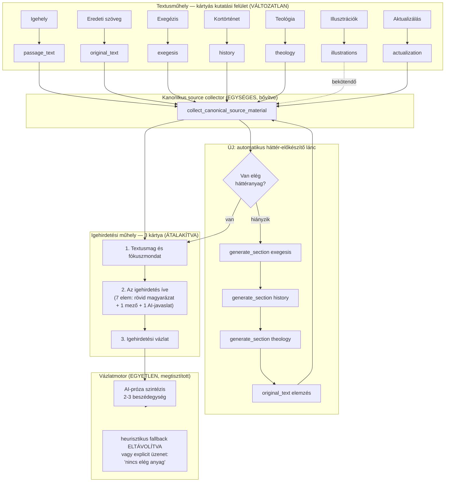
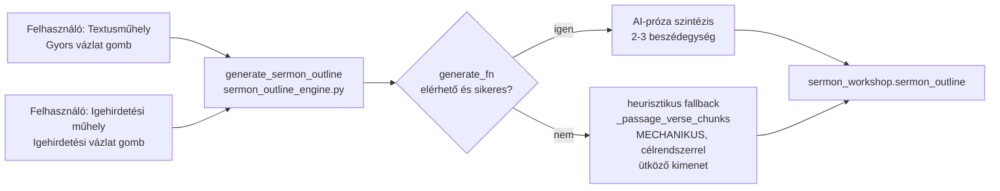

# Textus — teljes, bizonyítékokra épülő igehirdetés-előkészítési architektúra-audit

Ág: `refactor/two-workshop-flow` · Dátum: 2026-08-13 · **Ez a dokumentum kizárólag vizsgálat. Nem történt kódmódosítás, hibajavítás, refaktor vagy commit.**

Módszertan: a jelentés a jelenlegi (uncommitted) munkafa tényleges kódját olvassa. Négy párhuzamos, egymástól független kutatás (Textusműhely leltár, Igehirdetési műhely leltár, adatmodell/session_state/canonical collector, AI-/prompt-leltár + vázlatmotorok + 3 hívási lánc) eredményét vetettem össze, és minden állítást fájl:sor szinten ellenőriztem. A korábbi, gyökérben talált auditdokumentumok (2026-08-04, 2026-08-11, 2026-08-12) kizárólag tájékozódási támpontként szolgáltak — egyetlen állításukat sem vettem át bizonyítékként, mindent újra, a jelenlegi kódból vezettem le.

---

## 1. Vezetői összefoglaló

A Textus két műhelye (**Textusműhely** — kutatás/elemzés, **Igehirdetési műhely** — homiletikai építkezés) architekturálisan **egyetlen közös vázlatmotoron** (`sermon_outline_engine.generate_sermon_outline`) és **egyetlen közös kanonikus forrás-dispatcheren** (`_block_is_context_ready`, `sermon_outline_engine.py:1754-1763`) keresztül van összekötve. Ez jó hír: a korábbi auditok (2026-08-04 – 2026-08-12) által dokumentált "több párhuzamos vázlatmotor" és "normál/fallback eltérő forráscsomag" problémák a mai kódállapotban **nincsenek jelen** — mindkettőt konkrét tesztek védik (`tests/test_canonical_source_collector.py`, `tests/test_homiletical_model_unification.py`).

Ami viszont **ma is fennáll, kóddal igazoltan**:

1. **A heurisztikus (AI nélküli) vázlat-fallback ág** (`sermon_outline_engine.py:2456-2838`) mechanikus, regex-alapú versdarabolást (`_passage_verse_chunks`) és a régi `points/movements` sémát használja — ez pontosan az, amit a célrendszer (16. célpont) kifejezetten tiltani akar, és a kód docstringje szerint ez **"a leggyakoribb éles eset"**, amikor a felhasználó AI nélkül állítja össze a vázlatot a meglévő anyagból.
2. **Négy "felülírás-megerősítő" UI-flag halott kód**: be vannak állítva, de sehol nincsenek kiolvasva — a fő gondolat / hallgatói feszültség / evangéliumi ív / igehirdetés útja szakaszoknál egy már jóváhagyott tartalom AI-javaslattal való felülírásának megerősítő párbeszéde **némán elakad** (`sermon_workshop_ui.py:561-564`, ld. 10. és 13. szakasz).
3. **Nincs automatikus belső háttérkutatási lánc**: ha hiányzik az exegézis/kortörténet/teológia, a rendszer NEM hívja meg automatikusan a Textusműhely saját AI-moduljait a hiány pótlására (12–13. célpont) — a felhasználónak manuálisan kell minden Textusműhely-fület végiglátogatnia.
4. **Illusztrációk és Énekajánló Textusműhely-tartalma soha nem jut el** a vázlatmotorhoz automatikusan (csak kézi kosárba tétellel) — funkcionális holtág.
5. **Öt munkafázis van négy helyett**: a Homiletikai belépési pont és a Megszólítás és bevonás ma is önálló, több mezős/gombos UI-szakasz — a célrendszer (6., 8. célpont) ezeket megszüntetné, beolvasztva az Ívbe.

A jelenlegi refaktor (uncommitted) helyes irányba tett lépéseket tartalmaz (kanonikus forrás-collector, tartalom-alapú — nem jóváhagyás-alapú — Textusműhely-forrás-gate, egységesített hétlépcsős modell dokumentálása), de a célrendszer 17 pontjából **6 még egyáltalán nem teljesül**, **7 részlegesen**, és csak **4 teljesül már ma**.

---

## 2. Aktuális branch és munkafa állapota

```
Branch: refactor/two-workshop-flow
```

### 2.1 A jelenlegi refaktorhoz tartozó változtatások (ELEMZETT kör)

| Kategória | Fájlok |
|---|---|
| Módosított core-modulok | `app.py`, `sermon_outline_engine.py`, `sermon_workshop_data.py`, `sermon_workshop_outline_ai.py`, `sermon_workshop_ui.py`, `textus_analytics.py`, `textus_workshop_data.py`, `textus_workshop_ui.py`, `workshop_nav_ui.py` |
| Új modulok | `sermon_workshop_engagement_ai.py`, `sermon_workshop_entry_point_ai.py`, `textus_summary_ai.py` |
| Új tesztek | `tests/test_canonical_source_collector.py`, `tests/test_engagement_ai.py`, `tests/test_entry_point_ai.py`, `tests/test_homiletical_model_unification.py`, `tests/test_sermon_workshop_phase_migration.py`, `tests/test_sermon_workshop_ui_state_sync.py` |
| Módosított tesztek | `tests/test_biblical_map_ui.py`, `tests/test_jude_e2e_workflow.py`, `tests/test_outline_canonical_content.py`, `tests/test_partial_outline_workflow.py`, `tests/test_quick_tools_grid.py`, `tests/test_regression_cross_features.py`, `tests/test_workshop_nav_ui.py` |

Diff-terjedelem (`git diff --stat HEAD`): **9 core-fájl, 2364 sor hozzáadás / 610 sor törlés**, ebből `sermon_workshop_ui.py` egyedül +1473/-… sor.

Function-szintű diff-kivonat a legfontosabb új függvényekről:
- `sermon_outline_engine.py`: `_canonical_source_is_stale`, `_canonical_source_is_usable`, `_block_is_context_ready`, `collect_canonical_source_material`, `_gated_fallback_bundle` — ez az új kanonikus collector gerince.
- `sermon_workshop_data.py`: `empty_engagement_element`, `normalize_engagement_element(s)`, `add/update/remove_engagement_element`, `save_engagement_suggestions`, `save_entry_point_suggestions`.
- `textus_workshop_data.py`: `get_default_text_summary`, `normalize_text_summary`, `update_text_summary_fields`, `save_text_summary_suggestions`.
- `workshop_nav_ui.py`: `sermon_phase_statuses`, `sermon_phase_completed` — az 5-fázisos magas szintű progressz-réteg.

### 2.2 Nem kapcsolódó, korábbi módosítások (KIHAGYVA, nem érintve)

A `git status` az alábbi, a mai refaktorral **semmilyen kapcsolatban nem álló** módosításokat is mutatja — ezekhez nem nyúltam, és bizonyítékként sem használtam:

- `data/biblical_places/enrichment_research/*.json` (8 fájl) + `cache/batch_001_research_cache.json` — egy korábbi, bibliai helyszín-gazdagítási batch-scriptfutás mellékterméke, semmi köze a prédikáció-előkészítéshez.
- `data/generated/tahot_ot_import_audit.json` (untracked) — a héber ÓSZ-import korábbi munkájából.
- Öt korábbi audit-dokumentum a gyökérben (`TEXTUS_AUDIT_FRISSITES_2026-08-04.md`, `TEXTUS_IGEHIRDETESI_MUHELY_ADATFOLYAM_AUDIT.md`, `TEXTUS_KET_MUHELY_REFAKTOR_AUDIT.md`, `TEXTUS_SOURCE_OF_TRUTH_TERV_2026-08-04.md`, `TEXTUS_TECHNIKAI_AUDIT_2026-08-04.md`) — csak tájékozódási támpontként kezelve, ld. fent.
- `.claude/`, `.refactor_pytest_2d_all/` — eszköz-/futtatókörnyezeti könyvtárak.

### 2.3 Diagnosztikai tesztfuttatás eredménye (nem módosító, csak futtatás)

**Az új refaktor-tesztek: 82/82 zöld** (`test_canonical_source_collector`, `test_engagement_ai`, `test_entry_point_ai`, `test_homiletical_model_unification`, `test_sermon_workshop_phase_migration`, `test_sermon_workshop_ui_state_sync`).

**Egy naming-eltérés a módosított tesztek között:**
`tests/test_partial_outline_workflow.py::test_context_bundle_token_efficient_no_aliases` (277. sor) `"passage_text" in bundle`-t vár, de a jelenlegi `collect_outline_context_bundle()` (`sermon_workshop_outline_ai.py:547-549`) már `"passage_reference"` kulcsot ad vissza. Ez a mai refaktor terminológia-váltásának (aliasmentesítés) egy le nem követett tesztje — **dokumentálva, nem javítva.**

**Öt, a mai refaktortól független, korábbról ismert bukás**, mind ugyanarra a gyökérokra vezethető vissza: `build_jude_state()` (`tests/test_jude_e2e_workflow.py:107-142`) a `http_jude()` fixture-rel hívja `fetch_ruf_passage()`-t, de a visszakapott `passage_text` üresen marad ("a RÚF-szöveg nem volt betölthető" hibaüzenettel) — ez **azonos** a 2026-08-04-es korábbi auditban már dokumentált HTML-fixture/JSON-parser inkompatibilitással, tehát nem a mai refaktor okozza:

- `tests/test_sermon_outline.py::test_c_references_only_no_full_bible_text`
- `tests/test_sermon_outline.py::test_h_no_silent_overwrite_manual_edit`
- `tests/test_outline_synthesis_quality.py::test_full_jude_sources_usable_outline`
- `tests/test_rc_outline_lection_regressions.py::test_stale_empty_widgets_do_not_wipe_outline_on_flush`
- `tests/test_rc_outline_lection_regressions.py::test_approve_rejects_empty_shell_and_keeps_content`

**Ezt a hibát nem javítottam** (az utasítás szerint tilos volt), csak dokumentálom: fixture/parser-hiba, nem termékkód-regresszió.

---

## 3. Felületi és funkcionális leltár

### 3.1 Textusműhely — 14 fül

Belépési pont: `render_quick_tools_tabs()` (`workshop_nav_ui.py:627-668`), hívja `app.py:8053`. Minden AI-hívás egyetlen közös függvényen megy át: `generate_text()` (`app.py:6390-6820`), modellválasztás `resolve_gemini_model_for_tab()` (`app.py:279-293`) a `GEMINI_MODEL_BY_TAB_LABEL` táblából (`app.py:241-259`).

| # | Fül | Render fn | AI/DB | Mentés (session-kulcs) | Kosárba tehető | Automatikus vázlatmotor-forrás |
|---|---|---|---|---|---|---|
| 0 | **Igehely** | `render_igehely_panel` (`app.py:7314`) | RÚF-DB (`ruf_bible_service`) + opcionális "Áttekintés" AI (`SECTION_PROMPTS["overview"]`) | `passage_text`, `last_igehely`, `overview` | **nincs gomb** | csak a nyers `passage_text`/`passage_reference` — az `overview` **NEM** |
| 1 | **Eredeti szöveg tanulmányozása** | `render_original_text_panel` (`app.py:7434`) | `build_original_text_prompt` + helyi lexikon-widget (`bible_engine/greek_analysis_ui.py`) | `original_text`, `original_text_status` | igen (`app.py:7565`) | **igen** (freshness-only, jóváhagyás nem feltétel) |
| 2 | **Exegézis** | `render_section_tab(key="exegesis")` (`app.py:4483`) | `SECTION_PROMPTS["exegesis"]` + `validate_exegesis_has_support()` | `exegesis`, `exegesis_status` | igen (`app.py:4610`) | **igen** (freshness-only, *elfedhető* Textusösszegzéssel) |
| 3 | **Kortörténet** | ua. minta, `key="history"` | `SECTION_PROMPTS["history"]` | `history`, `history_status` | igen | **igen** (ua. elfedési szabály) |
| 4 | **Teológia** | ua. minta, `key="theology"` | `SECTION_PROMPTS["theology"]` | `theology`, `theology_status` | igen | **igen** (ua. elfedési szabály) |
| 5 | **Illusztrációk** | `render_section_tab(key="illustrations", approvable` **hiányzik**`)` (`app.py:8098`) | `SECTION_PROMPTS["illustrations"]` | `illustrations` (sima string) | igen | **NEM** — nincs a `_CANONICAL_TEXTUS_SOURCE_KEYS`-ben, csendes holtág |
| 6 | **Aktualizálás** | `render_section_tab(key="actualization")` (`app.py:8107`) | `SECTION_PROMPTS["actualization"]` + Google-keresés (`enable_google_search=True`) | `actualization` | igen | **igen**, egyedüliként **feltétel nélkül mindig** (nem elfedhető) |
| 7 | **Vázlat** ("Gyors vázlat") | inline `app.py:8121-8266` | `sermon_outline_engine.generate_sermon_outline(mode="quick")` | `sermon_workshop.sermon_outline` | n/a | ez maga az integrációs pont |
| 8 | **Vázlatkosár** | inline `app.py:8273-8326` | — | `basket` (lista) | — | **igen**, `outline_basket` néven, gate nélkül mindig bekerül |
| 9 | **Énekajánló** | inline `app.py:8341-8448` | `build_songs_prompt` (tisztán promptalapú, nincs helyi énekes-DB) | `songs` | igen | csak kosáron át — automatikus **NEM** |
| 10 | **Igehirdetési sorozat tervező** | inline `app.py:8564-8724` | `SERIES_PLANNER_SYSTEM_PROMPT` | `series_planner_output`, `series_idea`, `series_cadence`, `series_weeks` | **nincs gomb** | **NEM** — teljesen izolált, sem kosár, sem bundle nem éri el |
| 11 | **A textus fő gondolata** | `render_text_main_idea_section` (`textus_workshop_ui.py:458`) | `suggest_text_main_idea`/`assess_user_main_idea` (`textus_main_idea_ai.py`) | `text_workshop.text_main_idea` | n/a (közvetlen) | **igen** (freshness-only) + `approved_insights` |
| 12 | **Textusösszegzés** | `render_text_summary_section` (`textus_workshop_ui.py:897`) | `suggest_text_summary` (`textus_summary_ai.py`) | `text_workshop.text_summary` | n/a (közvetlen) | **igen** (freshness-only), és **elfedi** a 2-4. sor nyers mezőit, ha van tartalma |
| 13 | **Útmutatás** | inline `app.py:8472-8557` | nincs | nincs | — | n/a (statikus szöveg) |

**A legfontosabb, kóddal igazolt megállapítások:**
- **Illusztrációk** és **Énekajánló** AI-tartalma kizárólag kézi "Hozzáadás a vázlatkosárhoz" úton juthat tovább — a másik hat elemző fülhöz (Exegézis, Kortörténet, Teológia, Eredeti szöveg, Aktualizálás, Fő gondolat, Textusösszegzés) képest ez eltérő, dokumentálatlan bánásmód.
- **Igehirdetési sorozat tervező** funkcionálisan teljesen szigetel — a projektbe elmentődik, de sehova nem folyik tovább.
- **Textusösszegzés jelenléte (akár draft állapotban) elfedi** a nyers Exegézis/Kortörténet/Teológia/Eredeti szöveg mezőket a vázlatmotor promptjában (`sermon_workshop_outline_ai.py:627-671`) — ez ellentmond a `textus_workshop_ui.py:903-906` docstringjének, amely "jóváhagyás után" fogalmaz, miközben a tényleges kapu a **tartalom megléte**, nem a jóváhagyás.
- A Fő gondolat/Textusösszegzés MI-segéd hívásainak `tab_label`-jei nincsenek a `GEMINI_MODEL_BY_TAB_LABEL` táblában → csendben a nehezebb `gemini-2.5-flash`-re esnek vissza a könnyebb `flash-lite` helyett.

### 3.2 Igehirdetési műhely — 5 munkafázis

Fájlszerepek: `sermon_workshop_ui.py` (11648 sor, minden `render_*`), `sermon_workshop_data.py` (2522 sor, durable-state), `workshop_nav_ui.py` (1415 sor, navigáció+progressz). A magas szintű fázisokat `SERMON_PHASE_OPTIONS` (`workshop_nav_ui.py:1326-1332`) definiálja.

| Fázis | Fő render fn | Almezők/almodulok | AI-modul(ok) | Kanonikus gate |
|---|---|---|---|---|
| **1. Textusmag és fókuszmondat** | `render_text_core_and_focus_section` (`sermon_workshop_ui.py:9179`) | (a) `render_text_main_idea_section` — Textusműhely saját state-je, csak megjelenítve; (b) `render_text_summary_section` — ua.; (c) `render_sermon_main_idea_section` (9219) — Igehirdetési műhely saját "Fókuszmondat" mezője | `sermon_workshop_m4_ai.suggest/assess_sermon_main_idea` | n/a a Fő gondolat/Összegzésre (`_CANONICAL_TEXTUS_SOURCE_KEYS`); `sermon_main_idea` a `_HOMILETICAL_DECISION_KEYS` tagja |
| **2. Homiletikai belépési pont** | `render_entry_point_section` (10136) | `today_connection`, `type`, `entry_point.text` | `sermon_workshop_entry_point_ai.suggest_entry_point` | `_HOMILETICAL_DECISION_KEYS` (jóváhagyás+frissesség) |
| **3. A prédikáció íve** | `render_sermon_path_section` (11224) → `render_gospel_arc_section` (10614) → `render_closing_section` (7877) | Alaphelyzet/Első fordulópont/Mélyítés (sermon_path) → Második fordulópont (christ_centered_arc) → Megérkezés (closing) | `m6_ai`, `m5_gospel_ai`, `m7_ai`/`m7_closing_ai`/`m7_simple_ai` | ua. |
| **4. Megszólítás és bevonás** | `render_engagement_section` (7800) | `engagement_elements` lista, elem-szintű jóváhagyás | `sermon_workshop_engagement_ai.suggest_engagement_elements` | elemenkénti `status=="approved"` szűrés |
| **5. Igehirdetési vázlat** | `render_outline_section` (3682) | — | `sermon_workshop_outline_ai.assemble_sermon_outline` → `sermon_outline_engine.generate_sermon_outline` | teljes bundle |

**Navigáció/progressz** (`workshop_nav_ui.py`): két réteg — (a) 11-12 "régi" szakaszállapot `sermon_section_statuses()` (1082-1225, 4 fokozat: `approved > own_emphasis > ai_suggested > ai_ready`); (b) az 5-fázisos összesítés `sermon_phase_statuses()`/`sermon_phase_completed()` (1358-1392), ami fázisonként a legmagasabb rangú szakaszállapotot veszi.

**Mentés/jóváhagyás mintázat**: `_persist_*_from_widgets()` → `update_sermon_workshop_section()` (`sermon_workshop_data.py:1525-1712`, egyetlen belépési pont minden `_status` íráshoz, automatikus hash-bélyegzés jóváhagyáskor) → `accept_workshop_proposal()` (`finalize=False` mindig `draft`-ot ad, sosem automatikusan `approved`-ot).

**Igazolt hiányosságok** (részletesen 10. és 13. szakasz):
1. Négy "felülírás-megerősítő" flag halott kód (`_ADOPT_SERMON/LT/GA/PATH_OVERWRITE_CONFIRM`) — csak a `human_condition` (legacy) szakasznál van ténylegesen renderelve az öt közül.
2. A Belépési pont adopt-útvonala egyáltalán nem hívja a `section_has_accepted_content` védelmet — jóváhagyott belépési pont egyetlen kattintásra, megerősítés nélkül felülíródik.

---

## 4. Fájl- és függvényszintű hívási térkép — 3 teljes nyomkövetés

### 4.1 Exegézis generálása és felhasználása

```
Textusműhely "Exegézis" fül (app.py:8069)
  → render_section_tab(key="exegesis")           app.py:4483-4618
  → "Generálás" gomb → generate_section("exegesis")   app.py:4433-4470
      → _sync_inputs_to_last()                    app.py:4013
      → build_alap_from_state()                   app.py:4066
      → SECTION_PROMPTS["exegesis"].format(...)   app.py:3660-3739
      → generate_text(prompt, tab_label="Exegézis")  app.py:6390 → HTTP POST Gemini
  → st.session_state["exegesis"] = válasz          app.py:4461
  → validate_exegesis_has_support() figyelmeztetés  app.py:4402-4430,4466-4469
  → "Jóváhagyom" → exegesis_status="approved" + exegesis_approved_context_hash bélyegzés
                                                    app.py:4535-4552,4575-4597

Későbbi felhasználás:
  → sermon_outline_engine.py:2583  (heurisztikus fallback ág, bundle.get("exegesis"))
  → sermon_workshop_m4_ai.py:373   (Fókuszmondat AI-kontextus)
  → sermon_workshop_m5_ai.py:331   (Hallgatói feszültség AI-kontextus)
  → sermon_workshop_m7_simple_ai.py:245  (illusztráció-fallback)
  → textus_summary_ai.py:159       (Textusösszegzés AI bemenete)
  → collect_outline_context_bundle()  sermon_workshop_outline_ai.py:601-611
        (_CANONICAL_TEXTUS_SOURCE_KEYS tagja → bekerül a vázlatmotor promptjába,
         KIVÉVE ha van tartalommal bíró Textusösszegzés, ld. 12. fül)
```

### 4.2 Textusösszegzés és fókuszmondat generálása

```
Textusműhely "A textus fő gondolata" fül
  → render_text_main_idea_section()   textus_workshop_ui.py:458
  → kézi szöveg (_KEY_IDEA_INPUT) VAGY "Javaslatok készítése"
      → suggest_text_main_idea()      textus_main_idea_ai.py:985
      → build_main_idea_suggest_prompt()  textus_main_idea_ai.py:676
      → generate_text(..., tab_label="Textus fő gondolat — javaslat")
        [nincs a modell-táblában → hallgatólagos LOCKED_MODEL fallback]
  → "Jóváhagyom és átadom" → _approve_main_idea_and_forward()  textus_workshop_ui.py:575-599
      → update_text_main_idea(..., status="approved")  textus_workshop_data.py:149-217
      → add_approved_insight(category="Fő gondolat")   textus_workshop_data.py:156-173
      → text_workshop.text_main_idea / text_main_idea_status

Textusműhely "Textusösszegzés" fül
  → render_text_summary_section()     textus_workshop_ui.py:897
  → négy kézi mező (base_tension, key_exegetical_findings,
    theological_emphases, genre_structure_notes) VAGY
    "Javaslatok készítése" → suggest_text_summary()  textus_summary_ai.py:457
      → build_summary_suggest_prompt()  textus_summary_ai.py:287
        (bemenet: jóváhagyott exegézis+teológia+kortörténet+text_main_idea)
      → generate_text(..., tab_label="Textusösszegzés — javaslat")
        [ua. hallgatólagos LOCKED_MODEL fallback]
  → "Mentés"/"Jóváhagyom" → update_text_summary_fields()  textus_workshop_data.py:248-305
      → text_workshop.text_summary{...} + approved_context_hash bélyegzés MINDEN
        tartalmas mentéskor (nem csak jóváhagyáskor)

Igehirdetési műhely "Textusmag és fókuszmondat" fázis
  → render_text_core_and_focus_section()  sermon_workshop_ui.py:9179-9217
      (a)+(b): a fenti két Textusműhely-szekció ÚJRAFELHASZNÁLVA (nem duplikált kód,
               ugyanazt a text_workshop state-et jeleníti meg)
      (c): render_sermon_main_idea_section()  sermon_workshop_ui.py:9219-9373
           — SAJÁT, homiletikai "Fókuszmondat" mező (sermon_main_idea),
             AI-segéd: sermon_workshop_m4_ai.suggest/assess_sermon_main_idea
           — bemenetként megkapja text_main_idea-t (_collect_m4_kwargs, 2080)
             de KÜLÖN mezőként tárolja, nem írja felül

Ütközéskezelés a vázlatmotor felé (sermon_workshop_outline_ai.py:807-835,
_prefer_main_idea): sermon_main_idea (approved) > text_main_idea (approved) >
sermon_main_idea (draft is) > text_main_idea (draft) > approved_insights > user_focus
```

### 4.3 Igehirdetési vázlat készítése a gombnyomástól a megjelenítésig

```
UI gomb: "Vázlat összeállítása/frissítése a meglévő anyagból"
                                        sermon_workshop_ui.py:3753 (render_outline_section, 3682)
  → overwrite-guard (manuálisan szerkesztett vázlat esetén 2. megerősítő kattintás)
                                        sermon_workshop_ui.py:3754-3765
  → _assemble_and_save_outline()       sermon_workshop_ui.py:2904-2941
  → assemble_sermon_outline(mode="workshop", polish=False, synthesize=True)
                                        sermon_workshop_outline_ai.py:2398-2440
  → generate_sermon_outline(mode="workshop", generate_fn=generate_text)
                                        sermon_outline_engine.py:3476-3700+
      1. assess_outline_readiness()           (readiness-ellenőrzés)
      2. collect_outline_evidence(session,sw)  sermon_outline_engine.py:1597
      3. extract_outline_background_material() sermon_outline_engine.py:1813-1835
             ← _block_is_context_ready() dispatcher, 1754-1763
             ← _CANONICAL_TEXTUS_SOURCE_KEYS (tartalom+frissesség)
             ← _HOMILETICAL_DECISION_KEYS   (jóváhagyás+frissesség)
             ← outline_basket (gate nélkül mindig)
      4. build_outline_user_prompt()          sermon_outline_engine.py:1941
      5. _ai_generate_structured()            sermon_outline_engine.py:2838-2930
             → _call_generate() system_bundle=OUTLINE_SYSTEM_PROMPT,
               max_output_tokens=8000          sermon_outline_engine.py:2269
             → generate_text() → app.py:6390 → HTTP POST Gemini
             → válasz: elsődlegesen szabad Markdown-próza
               (markdown_outline_to_structured), másodlagosan JSON-kompat
         HA generate_fn is None VAGY az AI-hívás sikertelen/csonka:
      5b. _heuristic_structured_from_bundle()  sermon_outline_engine.py:2456-2838
             — determinisztikus, _passage_verse_chunks() (2388-2413, regex
               versszám-daraboló) + session-mezők összefűzése a régi
               points/movements sémába — MECHANIKUS KIMENET
      6. validate_structured_outline()         sermon_outline_engine.py:1062
      7. hiba esetén eszkaláció: _compress_structured / _enrich_structured /
         _rescue_structured_outline          sermon_outline_engine.py:2977,3142,3396
  → save_sermon_outline()                    sermon_workshop_data.py:2371-2420
      (üres tartalom sosem maradhat approved; mirror_outline_to_session_strings
       a legacy outline/outline_draft session-kulcsokra)
  → sermon_workshop.sermon_outline mentve
  → megjelenítés: render_compact_sermon_outline / outline_canonical_text

Ugyanez a motor, MÁSIK belépési pont:
Textusműhely "Vázlat" fül → app.py:8183-8188
  → generate_sermon_outline(st.session_state, mode="quick", generate_fn=generate_text,
                             force_overwrite=True)
  (mode="quick" csak a readiness-üzeneteket és a force_overwrite viselkedést
   változtatja — a forrásgyűjtés, prompt, motor azonos)
```

---

## 5. Adatmodell- és source-of-truth térkép

### 5.1 Rétegek

1. **`st.session_state`** — élő munkapéldány, a munka közbeni igazi forrás.
2. **Lapos (flat) legacy session-kulcsok** (`exegesis`, `history`, `theology`, `illustrations`, `actualization`, `original_text`, `outline`, `outline_draft`…) — Textus 1.0-örökség, alapértékek `app.py:5624-5703`.
3. **`text_workshop`** (`TEXT_WORKSHOP_KEY`, `textus_workshop_data.py:14`) és **`sermon_workshop`** (`SERMON_WORKSHOP_KEY`, `sermon_workshop_data.py:15`) — a két-műhely refaktor beágyazott state-jei.
4. **Projekt-perzisztencia** (Supabase `projects.project_data` JSON + fájlexport) — `workspace_data.PROJECT_DATA_KEYS` (`workspace_data.py:97-102`) allowlist.

### 5.2 Adatonkénti source-of-truth táblázat

| Adat | Kanonikus mező | Versengő/régi mező | Vázlatmotor-gate |
|---|---|---|---|
| Igehelyazonosító | `last_igehely` (session) | `igehely_input`, `passage_reference` — **három külön implementáció** olvassa ugyanazt a prioritási láncot (`sermon_outline_engine.py:1621-1628` és `:1933-1937`), szétcsúszás-kockázattal | `_CANONICAL_TEXTUS_SOURCE_KEYS`-en kívül, mindig bekerül |
| Bibliai szöveg | `passage_text` + 4 forrás-metaadat mező (`bible_text_ui.py:40-43`) | — | ua. |
| Felhasználó által szerkesztett szöveg | **nincs külön mező** — felülírja `passage_text`-et, `passage_text_source="user_override"` jelzi | `passage_text_last_fetched_text` — csak összevetési alap, nem tartalom | — |
| **Két külön "elavultság" fogalom** | `passage_content_stale`/`passage_stale_from_reference` (UI-banner, csak referenciaváltásra reagál, `passage_search_ui.py:41-42,151-156`) | `_canonical_source_is_stale` (hash-alapú, `sermon_outline_engine.py:1731-1744`) | **a kettő nem ugyanazt méri — inkonzisztens felhasználói visszajelzés kockázata** |
| Eredeti nyelvi adat (AI-elemzés) | `original_text` (session, lapos string) | a Konkordancia-modul (`bible_engine/`) strukturált lexikon-adata — **teljesen független adatút**, csak névileg "ugyanaz a téma" | `_CANONICAL_TEXTUS_SOURCE_KEYS` |
| Exegézis/Kortörténet/Teológia | `exegesis`/`history`/`theology` + `_status` + `_approved_context_hash` (generáláskor ÉS jóváhagyáskor is bélyegzett) | — (nincs kézi szerkesztő mező, csak teljes újragenerálás) | `_CANONICAL_TEXTUS_SOURCE_KEYS`, elfedhető Textusösszegzéssel |
| Aktualizálás | Textusműhely: lapos `actualization` string, **nincs approvable gomb**, mégis mindig bélyegzett hash | Igehirdetési műhely: `sermon_workshop.actualization_suggestions/connections/user_direction` — **más struktúra, más cél (M7 enrichment)**, a végleges vázlatba `sermon_outline.actualization_connections` mezőn át külön csatornán jut be | Textusműhely-verzió: `_CANONICAL_TEXTUS_SOURCE_KEYS`, feltétel nélkül mindig |
| **Illusztrációk — névütközés** | Textusműhely: lapos `illustrations` **string** — **SOHA nem jut el a vázlatmotorhoz** (nincs egyik kulcshalmazban sem) | Igehirdetési műhely: `sermon_workshop.illustrations` — strukturált lista, `enrichment_status=="approved"` esetén ténylegesen bekerül a vázlatba | két adat, egy név, csak az egyik funkcionális |
| Textusösszegzés | `text_workshop.text_summary{main_idea,base_tension,key_exegetical_findings,theological_emphases,genre_structure_notes,status,approved_context_hash}` (`textus_workshop_data.py:21-34`) | — | `_CANONICAL_TEXTUS_SOURCE_KEYS`, **elsőbbséget élvez** a nyers mezőkkel szemben tartalom (nem jóváhagyás) alapján |
| A textus fő gondolata | `text_workshop.text_main_idea` | **fogalmilag hasonló, de külön**: `sermon_workshop.sermon_main_idea` (homiletikai "Fókuszmondat") — explicit prioritási szabály ütközéskor: `_prefer_main_idea()` (`sermon_workshop_outline_ai.py:807-835`) | mindkettő eljut, de eltérő szabállyal |
| Fókuszmondat | **nincs önálló mező** — `sermon_outline.main_idea` régi alias-neve (`normalize_sermon_outline`, `sermon_workshop_data.py:466-467`, `focus_sentence`→`main_idea`) | — | — |
| A hét homiletikai elem | `entry_point`, `sermon_path.{starting_point,first_shift,deepening,reinterpretation}`, `christ_centered_arc`, `closing` (+legacy `sermon_path.destination`) | Legacy, UI-ból eltávolított, de adatmodellben élő: `human_condition` (5 mező), `listener_tension` (4 mező) — egyszeri migrációs backfill (`entry_point_legacy_prefilled` flag) | `_HOMILETICAL_DECISION_KEYS` — **KIVÉVE `listener_tension`, ami NINCS ebben a halmazban** → gate nélkül, akár draft állapotban is átmehet, ha valahogy `approved`-ra kerülne |
| Megszólító elemek | `sermon_workshop.engagement_elements` (lista, elemenkénti `status`) | — | elemenkénti `status=="approved"` szűrés; **saját, szűkebb kontextusgyűjtő** (`_collect_approved_engagement_kwargs`, `sermon_workshop_ui.py:7612-7638`) szigorúbb szabályt alkalmaz (csak `approved` Textusösszegzés/Fő gondolat), mint a kanonikus collector (tartalom is elég) — **dokumentálatlan kettős mérce** |
| Vázlat | `sermon_workshop.sermon_outline` (dict, `status: draft/approved/empty/needs_refresh`, saját `context_hash`/`source_fingerprint`) | lapos `outline`/`outline_draft` — **ma már csak tükör**, nem önálló forrás (`mirror_outline_to_session_strings`) | — |
| Korábbi vázlatok/history | **nincs verziótörténet** — csak egy `legacy_outline_text` mező a migráció előtti szövegnek | — | — |
| Vázlatkosár | lapos `basket` lista | — | `outline_basket` néven, gate nélkül mindig bekerül |

### 5.3 `session_state` vs. projekt tartós állapota

Munka közben `st.session_state` az élő igazság; a felhőbe **csak explicit "Mentés" gombra vagy 3 percenkénti autosave-re** kerül ki, és **csak már egyszer explicit elmentett** projektnél (`_maybe_autosave_project`, `app.py:5059-5073`, `if not current_project_id: return`, `app.py:5063-5065`).

**Konkrét adatvesztési kockázat**: egy vadonatúj, még sosem mentett projektnél az autosave nem fut — ha a Streamlit-folyamat megszakad mentés előtt, a teljes munkamenet (minden jóváhagyott exegézis/vázlat-adat) helyreállíthatatlanul elvész.

Betöltéskor `sanitize_project_data_report()` (`workspace_data.py:428-497`) végzi a migrációs/backfill allowlist-szűrést, sosem dob kivételt hiányzó mezőn.

### 5.4 Egyéb konkrét inkonzisztencia-kockázatok

- **Két hash-függvény** a vázlat-relevanciára: `compute_passage_context_hash` (szűk, blokkonkénti staleness) vs. `compute_context_hash` (széles, teljes vázlat `needs_refresh`) — ha csak az egyiket bővítik egy új mezővel, szétcsúszhatnak.
- **`entry_point_legacy_prefilled` re-triggerelési kockázat**: ha egy régi projektet exportálnak és a JSON-t kézzel szerkesztve importálják vissza a flag nélkül, a migráció újra lefuthat és felülírheti a felhasználó időközbeni kézi szerkesztését.
- Fájl-workspace-import (`deserialize_workspace`) **nem** hozza vissza a `PROJECT_EXTRA_*` mezőket (pl. `series_cadence`) — csak a felhő-projekt JSON-importnál működik teljesen.

---

## 6. AI-, prompt- és modellleltár

**Egyetlen tényleges modellhívó function az egész appban**: `generate_text()` (`app.py:6390-6820`), nyers `requests.post` a Gemini `generateContent` végpontra (`app.py:6518,6546`) — **nem** SDK. Minden más modul dependency injection-nel kapja meg `generate_fn: GenerateFn` paraméterként; nincs saját, párhuzamos hívási útjuk. Nincs Anthropic/OpenAI hívás a repóban.

- **Modellválasztás**: `resolve_gemini_model_for_tab()` (`app.py:279-293`), tábla `GEMINI_MODEL_BY_TAB_LABEL` (`app.py:241-259`) — két modell (`gemini-2.5-flash` / `gemini-2.5-flash-lite`), ismeretlen `tab_label` esetén csendes `LOCKED_MODEL` fallback.
- **System prompt**: `_build_payload()` (`app.py:6323-6387`) — alapból `BASE_SYSTEM_PROMPT` (`app.py:3393-3507`), de ha a hívó `system_bundle=` paramétert ad, az **teljesen kiváltja** (nem egészíti ki). Nincs natív Gemini system-role, minden egy `contents[0].parts[0].text`-be fűzve.
- **Validáció**: `ai_response_validation.sanitize_ai_json()` (`ai_response_validation.py:55-102`) — **kizárólag** a `sermon_outline_engine.py` legacy JSON-fallback ága használja. Minden más `_ai.py` modul saját, kézzel írt `extract_json_object()` regex-parsert használ (funkcionális duplikáció, ld. 8. szakasz).
- **Hibakezelés**: közös réteg `app.py`-ban (cache, globális cooldown, 429/5xx retry exponenciális backoff-fal, MAX_TOKENS-csonkulás detektálás) — az egyedi modulok csak a szöveges hibaválaszt (`⚠️`/`❌` prefix) ismerik fel.

### 6.1 AI-hívások teljes leltára

| Funkció | Fájl:függvény | Prompt-builder | tab_label | system_bundle |
|---|---|---|---|---|
| Áttekintés/Exegézis/Kortörténet/Teológia/Illusztrációk/Aktualizálás | `app.py:4433 generate_section(key)` | `SECTION_PROMPTS[key]` (`app.py:3624-4003`) | `SECTION_LABELS[key]` | nincs → `BASE_SYSTEM_PROMPT` |
| Finomító chat | `app.py:6896` | inline (`app.py:6879-6893`) | `f"chat: {title}"` | nincs → `BASE_SYSTEM_PROMPT` |
| Eredeti szöveg tanulmányozása | `app.py:7487-7489` | `build_original_text_prompt` (`app.py:4222`) | „Eredeti szöveg tanulmányozása” | `KEY_EXPRESSIONS_SYSTEM_PROMPT` (`app.py:6039`) |
| Énekajánló | `app.py:8410` | `build_songs_prompt` | „Énekajánló” | nincs → `BASE_SYSTEM_PROMPT` |
| Igehirdetési sorozat tervező | `app.py:8694` | inline | „Igehirdetési sorozat tervező” | `SERIES_PLANNER_SYSTEM_PROMPT` (`app.py:6111`) |
| Konkordancia (3 mód) | `passage_search_ai.py` | saját builderek | — | — |
| Textus fő gondolata (javaslat/értékelés) | `textus_main_idea_ai.py:985,1080` | `build_main_idea_suggest/assess_prompt` (`:676,681`) | „Textus fő gondolat — javaslat/értékelés” (nincs modell-táblában) | `MAIN_IDEA_SYSTEM_BUNDLE` (`:42`) |
| Textusösszegzés | `textus_summary_ai.py:457` | `build_summary_suggest_prompt` (`:287`) | „Textusösszegzés — javaslat” (nincs modell-táblában) | `SUMMARY_SYSTEM_BUNDLE` (`:40`) |
| Fókuszmondat/Emberi helyzet (M4) | `sermon_workshop_m4_ai.py:1341,1419,1492,1563` | saját | belső `_call_generate` | `M4_SYSTEM_BUNDLE` |
| Hallgatói feszültség (M5) | `sermon_workshop_m5_ai.py` | saját | — | saját |
| Második fordulópont (M5-gospel) | `sermon_workshop_m5_gospel_ai.py` | saját | — | saját |
| Ív/mozgások (M6) | `sermon_workshop_m6_ai.py` | saját | — | saját |
| **Belépés** | `sermon_workshop_entry_point_ai.py` (ÚJ) | saját, `has_sufficient_entry_point_material` API-hívás-kihagyás | „Homiletikai belépési pont — javaslat” | `ENTRY_POINT_SYSTEM_BUNDLE` |
| **Megszólítás** | `sermon_workshop_engagement_ai.py` (ÚJ) — csak jóváhagyott anyagot fogad | saját | — | `ENGAGEMENT_SYSTEM_BUNDLE` |
| Megérkezés/lezárás (M7) | `sermon_workshop_m7_ai.py`/`_closing_ai.py`/`_simple_ai.py` | saját | — | saját |
| Diagnosztika (M8, legacy) | `sermon_workshop_m8_ai.py` | saját | — | saját |
| Lekció/Ima (M9) | `sermon_workshop_m9_lection_ai.py`, `_prayer_ai.py`, `lection_link_ai.py` | saját | — | saját |
| **Igehirdetési/Gyors vázlat** | `sermon_outline_engine.py:2838 _ai_generate_structured` | `build_outline_user_prompt` (`:1941`) | `"Igehirdetési vázlat"` mindig (még `mode="quick"`-nél is) | `OUTLINE_SYSTEM_PROMPT` (`:307-507`) |
| Vázlat homiletikai diagnosztika | `sermon_outline_diagnostics_ai.py` | delegál | „Homiletikai diagnosztika” | `HOMILETIC_SYSTEM_PROMPT = OUTLINE_SYSTEM_PROMPT` |

**Orphan konfiguráció**: `app.py:254` (`"Vázlat": LOCKED_MODEL`) és `app.py:257` (`"Prédikációvázlat"`) tábla-bejegyzések soha nem használt `tab_label`-ek — a vázlatmotor mindig `"Igehirdetési vázlat"`-ot használ, saját `max_output_tokens=8000` explicit felülírással.

### 6.2 Textusműhely szakmai modulok újrafelhasználhatósága automatikus belső kutatáshoz

A négy elemző fül (Exegézis, Kortörténet, Teológia, Eredeti szöveg) AI-hívása (`app.py:4433 generate_section(key)`) **funkcionálisan elkülönített, egyenként hívható lépés** — mindegyiknek saját promptja (`SECTION_PROMPTS[key]`), saját `tab_label`-je és saját mentési kulcsa van. Ez azt jelenti, hogy **technikailag készen áll** egy automatikus, több-lépéses belső kutatási lánc építésére (célpont #12-13): a meglévő `generate_section("exegesis")`, `generate_section("history")`, `generate_section("theology")`, `build_original_text_prompt`+`generate_text` hívások **sorban, külön API-hívásokként** meghívhatók lennének, ha egy hiányzó mezőt észlel a rendszer — **de ez az orkesztráció ma sehol nem létezik**: nincs olyan kódút, ami a vázlatmotor vagy bármely Igehirdetési műhely-modul hívása előtt automatikusan futtatná ezeket a Textusműhely-generátorokat. A felhasználónak manuálisan kell meglátogatnia mind a négy fület.

---

## 7. Source/context collector elemzése

### 7.1 A collector-réteg felépítése

```
collect_outline_context_bundle()        sermon_workshop_outline_ai.py:525-804  (alias)
        │
        ▼
collect_available_sermon_material()     sermon_workshop_outline_ai.py:356-375
        │
        ├─► extract_outline_background_material()   sermon_outline_engine.py:1813-1835   ← AI-prompt (normál) útvonal
        ├─► _gated_fallback_bundle()                 sermon_outline_engine.py:1838-1862   ← heurisztikus fallback útvonal
        └─► collect_canonical_source_material()       sermon_outline_engine.py:1766-1810   ← önálló, strukturált nézet
```

Mindhárom **közös dispatcheren** megy át: `_block_is_context_ready()` (`sermon_outline_engine.py:1754-1763`) — ez garantálja, hogy a normál és a fallback út **azonos forráskészletet** lásson (tesztelve: `tests/test_canonical_source_collector.py:183-210`).

### 7.2 Két kulcscsoport, két szabály

- **`_HOMILETICAL_DECISION_KEYS`** (`sermon_outline_engine.py:575-591`, 8 kulcs: `sermon_main_idea, human_condition, listener_tension, entry_point, christ_centered_arc, sermon_path, sermon_movements, closing`) → `_block_is_approved_and_fresh` — **jóváhagyás ÉS frissesség** kell.
- **`_CANONICAL_TEXTUS_SOURCE_KEYS`** (`sermon_outline_engine.py:601-611`, 7 kulcs: `text_main_idea, exegesis, theology, history, original_text, text_summary, actualization`) → `_canonical_source_is_usable` — **csak tartalom + frissesség**, jóváhagyás **nem** feltétel ("Korrekciós fázis 3.1").

**Fontos rés**: `listener_tension` egyik halmaznak sem tagja → `_block_is_context_ready` default-ága `True`-t ad rá (`sermon_outline_engine.py:1763`) — ha egy régi projektben ez a legacy mező mégis `approved`-ra kerülne, **gate nélkül, akár draft tartalommal is** átmehetne a vázlatmotor promptjába.

### 7.3 Jóvá nem hagyott, felhasználó által szerkesztett, elavult adat kezelése

- **Draft, de tartalommal bíró anyag** a kanonikus forrásoknál automatikusan bekerül (`_background_value_is_usable`, `sermon_outline_engine.py:1683-1705`, csak üres/placeholder-szűrés). A homiletikai döntéseknél viszont a draft tartalom **kimarad**, és külön "KIMARADT, NEM JÓVÁHAGYOTT BLOKKOK" figyelmeztetésként kerül a promptba (`extract_outline_excluded_draft_blocks`, `sermon_outline_engine.py:1887-1901`, beépítve `:2031-2041`).
- **Felhasználó által szerkesztett tartalom**: nincs külön "user override" flag — a collector triviálisan az aktuális `session_state` értéket olvassa.
- **Stale/más textushoz tartozó adat**: `extract_stale_approved_blocks()` (`sermon_outline_engine.py:1865-1884`) mindkét csoportra listázza a stale blokkokat, "KIMARADT, ELAVULT JÓVÁHAGYÁSÚ BLOKKOK" címszó alatt a promptba építve.
- **Projekt-/textusazonosság**: nincs projekt-ID-alapú ellenőrzés — az azonosítás kizárólag **tartalmi hash**-en (igehely+fordítás+szöveg) alapul; mivel a bundle mindig egyetlen `session_state`-ből épül, ez a gyakorlatban nem okoz kereszt-projekt keveredést.

### 7.4 Mely modulok kerülik meg a kanonikus collectort

A homiletikai résmodulok **saját, szűkebb kwargs-gyűjtő** függvényei (`_collect_m4_kwargs`, `_collect_m5_kwargs`, `_collect_gospel_arc_kwargs`, `_collect_sermon_path_kwargs`, `_collect_enrichment_kwargs`, `_collect_closing_kwargs`, `_collect_lection_kwargs`, `_collect_prayer_kwargs`, `_collect_approved_engagement_kwargs` — mind `sermon_workshop_ui.py`-ban) **nem** a kanonikus collectort hívják, hanem közvetlenül a session/`sw`/`tw`-ből építik saját kontextusukat. Ez **szándékos, dokumentált** tervezési döntés (`sermon_workshop_engagement_ai.py:3-6`: *"nem olvas nyers, jóvá nem hagyott műhelymezőt... a hívó felelőssége, hogy KIZÁRÓLAG jóváhagyott tartalmat adjon át"*), de **inkonzisztens szigorúságú**: `_collect_approved_engagement_kwargs` (`sermon_workshop_ui.py:7612-7638`) csak `status=="approved"` Textusösszegzést/Fő gondolatot enged át — szigorúbb, mint a kanonikus collector "elég a tartalom" szabálya. Ugyanaz a felhasználói tartalom tehát két különböző szigorúsággal kezelt két különböző modulnál.

### 7.5 Minta forráscsomag (`collect_canonical_source_material` kimenete, ha van szöveg+exegézis+eredeti szöveg+kortörténet)

```json
{
  "passage": { "reference": "Jn 3,16", "text": "Mert úgy szerette Isten a világot...", "translation": "RÚF 2014" },
  "sources": {
    "exegesis": { "content": "...", "origin": "textusműhely", "editable_by_user": true, "current_passage": true },
    "history": { "content": "...", "origin": "textusműhely", "editable_by_user": true, "current_passage": true },
    "original_text": { "content": "...", "origin": "textusműhely", "editable_by_user": true, "current_passage": true }
  },
  "user_notes": [ { "source": "Exegézis", "content": "..." } ],
  "identity": { "passage_reference": "Jn 3,16", "passage_context_hash": "a1b2c3d4e5f6..." }
}
```
(`sources` kulcsai pontosan a `_CANONICAL_TEXTUS_SOURCE_KEYS` közül a ténylegesen kitöltöttek.)

---

## 8. Vázlatmotor- és fallbackleltár

**Végeredmény: egyetlen vázlatmotor van** — `sermon_outline_engine.generate_sermon_outline()`. Mindkét felület (Textusműhely "Gyors vázlat", Igehirdetési műhely "Igehirdetési vázlat") ugyanazon a függvényen keresztül éri el, csak `mode="quick"`/`"workshop"` paraméterrel.

| Elem | Szerep | Aktív/örökölt |
|---|---|---|
| `sermon_outline_engine.generate_sermon_outline` | **A** motor | aktív |
| ├─ `_ai_generate_structured` (AI-próza ág) | prompt+modellhívás, Markdown/JSON válasz, 2-3 beszédegység | aktív, ez adja a "szép" kimenetet |
| └─ `_heuristic_structured_from_bundle` (heurisztikus ág) | AI nélküli, determinisztikus, `_passage_verse_chunks()` regex-verzió-darabolóval a régi `points/movements` sémába | **aktív, és a docstring szerint "a leggyakoribb éles eset"**, amikor `generate_fn is None` |
| `build_outline_from_workshop` | nem-AI seed-builder, a heurisztikus ág `seed_outline`-ja | aktív, segéd |
| `sermon_workshop_outline_ai.py` | orkesztráció: kontextusgyűjtés, readiness-ellenőrzés, `assemble_sermon_outline` | aktív |
| `sermon_workshop_outline_synth_ai.py` | **NEM önálló motor** — (a) segédfüggvények lazy-importtal a fő motorba, (b) UI-oldali pontszintű újraírás ("Rész újragondolása") | aktív, de delegáló/kiszolgáló szerep |
| `sermon_outline_diagnostics_ai.py` | kritikus/elemző réteg egy már kész vázlaton, nem generátor | aktív |
| `sermon_workshop_m8_ai.py` | legacy diagnosztika, `adapt_m8_to_outline_diagnostics`-szal adaptálva az új diagnosztikai modulba | örökölt, adapterrel élő |

**Nincs elárvult/kettős vázlatmotor** — minden vonatkozó teszt (`test_outline_engine.py`, `test_sermon_outline.py`, `test_outline_synthesis_quality.py`, `test_outline_gold_patterns.py`, `test_outline_canonical_content.py`, `test_outline_quick_curation_gate.py`) ugyanezekre a modulokra hivatkozik.

**A legfontosabb kockázat**: a heurisztikus fallback **ténylegesen mechanikus, versdaraboló álvázlatot** termel — ez pontosan az, amit a célrendszer 16. pontja tilt, és a kód dokumentációja szerint **ez a leggyakoribb** út, amikor a felhasználó AI nélkül ("Vázlat összeállítása a meglévő anyagból") dolgozik.

---

## 9. A hétlépcsős modell tényleges bekötésének értékelése

**Kanonikus definíció helye**: kizárólag `sermon_outline_engine.py:420-475`, az `OUTLINE_SYSTEM_PROMPT` szövegében ("AZ EGYETLEN homiletikai modell", `:422`).

| Modell-elem | Adatmező | UI-szakasz | AI-modul | Gate |
|---|---|---|---|---|
| 1. Belépés | `entry_point.{today_connection,type,text}` | `render_entry_point_section` | `sermon_workshop_entry_point_ai` | `_HOMILETICAL_DECISION_KEYS` |
| 2. Alaphelyzet | `sermon_path.starting_point` | `render_sermon_path_section` | `m6_ai` | ua. |
| 3. Első fordulópont | `sermon_path.first_shift` | ua. | ua. | ua. |
| 4. Mélyítés és fokozás | `sermon_path.deepening` | ua. | ua. | ua. |
| 5. Átértelmezés (opcionális) | `sermon_path.reinterpretation` | ua. (expander alatt) | ua. | ua., explicit "ha nincs jóváhagyott tartalom, KIHAGYANDÓ" a promptban |
| 6. Második fordulópont | `christ_centered_arc.{divine_gracious_action,christ_connection,...}` | `render_gospel_arc_section` | `m5_gospel_ai` | ua. |
| 7. Megérkezés | `closing.{final_discovery,hope,call_or_response,...}` | `render_closing_section` | `m7_ai`/`m7_closing_ai` | ua. |

**Kötelező/opcionális ténylegesen**: egyik elem sem kötelező egyedileg — mind a `sermon_path`, mind a `christ_centered_arc`, mind a `closing` gate-je "legalább egy nem üres mező a blokkban" logikájú (`sermon_workshop_ui.py:11357,10703-10714,7939-7950`). Csak az Átértelmezés van a rendszerpromptban expliciten fakultatívnak jelölve — a többi hét elem formálisan egyenrangú "opcionális, de ajánlott" bemenet.

**Mi történik hiányzó elemekkel**: ha semmilyen jóváhagyott anyag nincs (`has_background` hamis), a prompt külön ágra vált, ami a modellt saját teológiai/nyelvi tudására utasítja (`sermon_outline_engine.py:2005-2029`) — a modell ekkor **maga tölti ki** a hét lépést anyag nélkül, nem hagyja ki azokat.

**Címke vagy tényleges vezérlés?**
- **AI-próza ágban**: valódi tartalmi vezérlés — a rendszerprompt explicit tiltja a hét elem 1:1, egymás mellé rendelt listaként való lemásolását (`:466-475`), és 2-3 beszédegységbe szintetizálást ír elő. A betartatás azonban **kizárólag promptszinten** történik — `validate_structured_outline()` (`:1062`) nem ellenőrzi lépésenként a hét elem jelenlétét, csak formai/hossz szabályokat.
- **Heurisztikus fallback ágban**: a hét elem **szó szerint, mezőnként** kerül egymás mellé fűzésre a régi `points/movements` sémában — itt nincs szintézis, csak konkatenáció. Egyetlen explicit sorrendi szabály van kódolva: Belépés elsőbbséget élvez Alaphelyzet felett (`sermon_outline_engine.py:2536-2538`).

**Második fordulópont mint teológiai/krisztológiai súlypont**: a mezőnevek (`divine_gracious_action`, `christ_connection`, `christ_connection_type`, `grace_enabled_response`) és a rendszerprompt szövege ezt szándékként kódolják, de **ez sem validált** kimeneti szinten — csak prompt-instrukció, nincs olyan ellenőrzés, ami elutasítaná a válasz, ha ez a súlypont hiányzik.

**Megérkezés visszakapcsolása a Belépéshez/fókuszmondathoz**: a prompt szövegében szerepel elvárásként, de nincs kód-szintű ellenőrzés (pl. kulcsszó-egyezés vagy szemantikai check) ami ezt kikényszerítené vagy validálná.

---

## 10. Duplikációk, wrapperláncok és örökölt kód

| # | Jelenség | Bizonyíték | Súlyosság |
|---|---|---|---|
| 1 | **Négy halott "felülírás-megerősítő" flag** | `_ADOPT_SERMON/LT/GA/PATH_OVERWRITE_CONFIRM` beállítva (`sermon_workshop_ui.py:1931,1961,1976,1991`), de sehol ki nem olvasva; a megosztott `_render_overwrite_confirm` (1998-2017) csak a `human_condition` (legacy) szakaszon van ténylegesen bekötve (9098-9101) | **Magas — valós, felhasználó által észlelhető funkcionális hiba**: a "Átveszem" gomb látszólag nem csinál semmit, ha a szakasz már jóváhagyott |
| 2 | **Belépési pont adopt-védelem hiánya** | `_request_adopt_entry_point_option/_today` (9992-9999) nem hívja `section_has_accepted_content`-et | **Magas** — jóváhagyott belépési pont csendben felülírható |
| 3 | **`illustrations` névütközés** | lapos string (Textusműhely, holtág) vs. strukturált lista (Igehirdetési műhely, funkcionális) | Közepes — félrevezető, de nem tör el semmit |
| 4 | **Két "fő gondolat" fogalom** | `text_main_idea` vs. `sermon_main_idea`, `_prefer_main_idea()` prioritási lánc (`sermon_workshop_outline_ai.py:807-835`) | Közepes — dokumentálatlan, könnyen összekeverhető karbantartáskor |
| 5 | **Két staleness-fogalom** | UI-banner (`passage_content_stale`) vs. hash-alapú gate (`_canonical_source_is_stale`) | Közepes — inkonzisztens felhasználói visszajelzés |
| 6 | **Két hash-függvény** | `compute_passage_context_hash` (szűk) vs. `compute_context_hash` (széles) | Alacsony-közepes — karbantartási drift-kockázat |
| 7 | **JSON-kinyerés funkcionális duplikációja** | `ai_response_validation.sanitize_ai_json` csak a vázlatmotor legacy JSON-ágában; minden más `_ai.py` modul (kb. 10+ fájl) saját kézzel írt `extract_json_object()`-et használ | Közepes — nincs egységes bemenet-validáció a legtöbb AI-válaszra |
| 8 | **`listener_tension` gate-hiány** | legacy mező, kimaradt mind `_HOMILETICAL_DECISION_KEYS`-ből, mind `_CANONICAL_TEXTUS_SOURCE_KEYS`-ből → default `True` a `_block_is_context_ready`-ben | Közepes — látens rés, ma nincs UI-út ami kihasználná, de régi projekt-JSON kézi szerkesztésével előidézhető |
| 9 | **Orphan modell-tábla bejegyzések** | `app.py:254,257` (`"Vázlat"`, `"Prédikációvázlat"`) tab_label-ek soha nem hívva | Alacsony — holt konfiguráció |
| 10 | **`sermon_workshop_outline_synth_ai.py` névfélrevezető** | a neve alapján önálló motornak tűnhet, valójában delegáló segédmodul + pontszintű újraíró | Alacsony — dokumentációs kockázat |
| 11 | **`sermon_workshop_m8_ai.py` adapter-lánc** | legacy modul, `adapt_m8_to_outline_diagnostics`-szal az új diagnosztikai rétegbe kötve | Alacsony — működik, de két generáció egymásra épül |
| 12 | **Kettős gating-szigor Megszólításnál** | `_collect_approved_engagement_kwargs` szigorúbb (csak approved), mint a kanonikus collector (tartalom is elég) | Közepes — dokumentálatlan inkonzisztencia |
| 13 | **Aktualizálás kettős csatornája** | Textusműhely lapos `actualization` (kanonikus kulcsokon át) vs. Igehirdetési műhely `actualization_connections` (M7-en, `sermon_outline.actualization_connections` mezőn át) — mindkettő funkcionális, de teljesen külön mechanizmus | Alacsony-közepes — nem hibás, de nehezen átlátható |
| 14 | **Flat `outline`/`outline_draft` mirror-mezők** | ma már csak derivált tükör a `sermon_outline.content`-ből, korábban bifurkált forrás volt | Alacsony — legacy maradvány, nem aktív duplikáció |

---

## 11. Gap analysis a célrendszerhez

| # | Célpont | Állapot | Blokkoló kód/döntés |
|---|---|---|---|
| 1 | Textusműhely marad kártyás kutatási felület | **Teljesül** | — |
| 2 | Textusösszegzés/Fő gondolat/Vázlat átkerül az Igehirdetési műhelybe | **Részben** | A Textusösszegzés és Fő gondolat ma **meg van jelenítve** a `render_text_core_and_focus_section`-ben (9179), de a state és a szerkesztés ténylegesen a Textusműhely `text_workshop`-jában marad — nincs valódi "áthelyezés", csak beágyazás. A "Vázlat" pedig ma is **két külön UI-belépési ponton** él (ld. #3). |
| 3 | Ne legyen külön gyorsvázlat és részletes vázlat | **Nem teljesül** | Két UI-gomb (`app.py:8183`, Textusműhely "Gyors vázlat"; `sermon_workshop_ui.py:3753`, Igehirdetési műhely szekció) — közös motor, de duplikált belépési pont a felhasználó felé |
| 4 | Egyetlen kanonikus, hétlépcsős motor | **Részben** | A motor egy, DE a heurisztikus fallback ág (8. szakasz) nem a hétlépcsős szintézist adja, hanem mechanikus konkatenációt |
| 5 | Igehirdetési műhely kártyás felület, mint Textusműhely | **Részben** | A szekciók léteznek, de sok mezős/gombos formák (suggest/assess/adopt/confirm 4 lépés) — nem "kártya" jellegű, egyszerű felület |
| 6 | Fő részek: Textusmag+fókuszmondat / Ív / Vázlat (3 rész) | **Nem teljesül** | Ma 5 fázis van: a Belépési pont és a Megszólítás önálló fázisként él (`SERMON_PHASE_OPTIONS`, `workshop_nav_ui.py:1326-1332`) |
| 7 | Ív hét eleménél csak rövid magyarázat + 1 mező + 1 MI-javaslat | **Nem teljesül** | Ma a hét elem 4 külön render-szekcióba (`entry_point`, `sermon_path`, `christ_centered_arc`, `closing`) és összesen 15+ mezőbe oszlik, mindegyikhez saját suggest/assess/adopt gombokkal |
| 8 | Ne legyen külön Belépési pont / Megszólítás / útvonalválasztó / mozgásszerkesztő / kérdéssor | **Nem teljesül** | `render_entry_point_section` és `render_engagement_section` önálló, teljes UI-szekciók maradtak |
| 9 | Mezők automatikusan mentődjenek; AI ne írja felül user tartalmat | **Részben, aktív hibával** | Van "flush" mentés navigáció előtt (`flush_sermon_workshop_from_widgets`), de nincs valódi mezőszintű auto-save (kell "Mentés vázlatként" kattintás); ÉS a 10. szakasz #1-#2 pontja szerint **igazolt** AI-felülírási védelmi hiba van élesben |
| 10 | Textusműhely anyagai automatikusan háttérforrás | **Többnyire teljesül** | `_CANONICAL_TEXTUS_SOURCE_KEYS` tartalom-alapú gate működik, DE Illusztrációk és Énekajánló kimaradnak (3. szakasz) |
| 11 | Csak bibliai szöveg esetén se blokkolódjon a generálás | **Teljesül** | A heurisztikus ág `generate_fn=None`-nal is fut, `build_outline_from_workshop` minimális anyaggal is ad kimenetet — bár ez maga a #4/#16 probléma forrása |
| 12 | Hiányzó háttéranyag: meglévő szakmai modulokkal automatikus belső előkészítés | **Nem teljesül** | Nincs ilyen orkesztráció sehol a kódban (6.2 szakasz) — a meglévő `generate_section()` hívások készen állnak rá, de nincs őket összefűző vezérlés |
| 13 | Automatikus háttérkutatás több lépésből, nem 1 giant promptból | **N/A (#12 hiánya miatt)** | Az építőelemek (külön exegézis/kortörténet/teológia hívás) már ma is lépésenként különállók — ez jó kiindulópont egy jövőbeli orkesztrációhoz |
| 14 | Helyi görög-héber DB marad hiteles forrás | **Teljesül** | `bible_engine/*` SQLite-repók, UI-widget közvetlenül olvassa, függetlenül az AI-szövegtől |
| 15 | Bizonytalan adatot az AI ne találjon ki | **Részben** | Csak promptszintű instrukció (pl. "ha nincs jóváhagyott tartalom, KIHAGYANDÓ"), nincs kimeneti validáció ami ezt kikényszerítené |
| 16 | AI-hiba esetén ne legyen mechanikus versdaraboló álvázlat | **Nem teljesül** | `_heuristic_structured_from_bundle` + `_passage_verse_chunks()` pontosan ezt teszi, és a docstring szerint ez a leggyakoribb éles út |
| 17 | Végső kimenet 2-3 koherens beszédegység, hét elem háttérstruktúra | **Részben** | Az AI-próza ág ezt teljesíti; a heurisztikus fallback ág (gyakori élő út) nem |

**Összegzés**: 4 teljesül, 7 részben, 6 nem teljesül.

---

## 12. „Megtartandó / átalakítandó / összevonandó / eltávolítandó” táblázat

| Kategória | Elem | Indoklás |
|---|---|---|
| **Megtartandó** | `sermon_outline_engine.generate_sermon_outline` AI-próza ága | egyetlen, tesztelt, a célrendszerrel összhangban lévő motor |
| | `_block_is_context_ready` dispatcher + `_CANONICAL_TEXTUS_SOURCE_KEYS`/`_HOMILETICAL_DECISION_KEYS` | garantálja a normál/fallback forráscsomag-azonosságot, jól tesztelt |
| | `bible_engine/*` helyi lexikon-DB | célpont #14 szerint marad hiteles forrás |
| | `generate_text()` egységes modellhívó réteg (cache, retry, cooldown) | jól működő közös infrastruktúra |
| | Vázlatkosár (`basket`/`outline_basket`) | egyszerű, működő, gate nélküli kézi áthidalás |
| **Átalakítandó** | Igehirdetési műhely 5 fázisa → 3 kártya | célpont #6 |
| | Az Ív hét eleme → rövid magyarázat+1 mező+1 javaslat-gomb mintázat | célpont #7 |
| | Heurisztikus fallback ág | ne termeljen mechanikus vázlatot — vagy explicit "nincs elég anyag" üzenetre cserélendő, vagy a szintetizáló logikát kell rá is kiterjeszteni |
| | Mezők mentése | valódi auto-save, kattintás nélkül (célpont #9) |
| | Négy halott overwrite-confirm flag | be kell kötni (renderelni) vagy el kell távolítani a beállításukat |
| | Belépési pont adopt-útvonal | `section_has_accepted_content` védelem hozzáadása a többi szakaszhoz hasonlóan |
| **Összevonandó** | `text_main_idea` + `sermon_main_idea` | célpont #2 szellemében egy kanonikus "fókuszmondat" fogalommá |
| | Két staleness-fogalom (`passage_content_stale` vs. hash-gate) | egy közös jelzésre |
| | Két hash-függvény | az egyik a másikból származtatva, vagy explicit dokumentált kapcsolat |
| | JSON-kinyerő logika (10+ helyen duplikált) | egységesítés `ai_response_validation`-re |
| | Textusműhely "Gyors vázlat" + Igehirdetési műhely "Igehirdetési vázlat" UI | egy belépési pont (a motor már közös) |
| **Eltávolítandó** | `app.py:254,257` orphan modell-tábla bejegyzések | holt konfiguráció |
| | Textusműhely lapos `illustrations` string, VAGY bekötése a kanonikus forrásokba | jelenlegi állapotban félrevezető holtág |
| | `human_condition`/`listener_tension` UI-mezők adatmodell-szintű maradványai | csak migrációs átmeneti időszak után, termékdöntéssel (ld. 17. szakasz nyitott kérdés) |
| | `listener_tension` gate-hiány | ezt függetlenül a nagyobb migrációtól **azonnal érdemes** lezárni (kis, önálló konzisztencia-javítás) |

---

## 13. Kockázatok és régi projektek migrációs kérdései

1. **Adatvesztés vadonatúj, még nem mentett projektnél**: az autosave csak már egyszer explicit mentett projekten fut (`app.py:5063-5065`) — folyamatmegszakadás esetén teljes munkamenet-vesztés.
2. **Csendben elakadó AI-javaslat-átvétel**: a 4 halott overwrite-confirm flag miatt a felhasználó láthatatlanul "elveszít" egy kattintást jóváhagyott szakaszoknál (10. szakasz #1).
3. **Belépési pont védelem nélküli felülírása**: külön, egyedi rés (10. szakasz #2).
4. **`listener_tension` gate-hiány**: látens, ma nem kihasználható UI-ból, de régi projekt-JSON kézi szerkesztésével vagy jövőbeli kódregresszióval előidézhető, gate nélküli draft-tartalom szivárgás a promptba.
5. **`entry_point_legacy_prefilled` re-triggerelési kockázat** export/import kör esetén, ha a flag elvész a JSON-ból.
6. **Két staleness-fogalom** ütközése: a felhasználó látszólag ellentmondó "elavult" jelzéseket kaphat a UI-banner és a tényleges gate-eredmény között.
7. **RÚF/Júdás E2E fixture-hiba** (2. szakasz) — nem a mai refaktor hibája, de amíg fennáll, 5 regressziós teszt nem véd ténylegesen a vázlatmotor "van bibliai szöveg" ágán.
8. **Régi projektek migrációja**: a `sanitize_project_data_report` megbízhatóan backfillel hiányzó mezőket, de nincs olyan mechanizmus, ami egy **nagyon régi** (pl. `human_condition`-only, `entry_point` nélküli) projektet automatikusan átvezetne az új, egyszerűsített (célrendszer szerinti) UI-ra — ez a #2-#8 célpontok megvalósításakor külön migrációs tervet igényel, mert a jelenlegi backfill csak adatmodell-szinten, nem UX-szinten egységesít.

---

## 14. Javasolt végleges célarchitektúra





**Alapelv**: a jelenlegi kanonikus collector és az egyetlen vázlatmotor jó alap — a célarchitektúra nem cseréli le ezeket, hanem (a) bővíti a collectort egy automatikus háttér-előkészítő réteggel, (b) egyszerűsíti az Igehirdetési műhely felületét 5 fázisról 3 kártyára, (c) megszünteti vagy átalakítja a mechanikus heurisztikus fallbacket.

---

## 15. Megvalósítási fázisok (max. 4, fázisonként 2-3 fő modul)

### Fázis 1 — Biztonsági/konzisztencia-javítások (nem architekturális, azonnal indítható)
**Érintett modulok**: `sermon_workshop_ui.py` (adopt-védelem), `sermon_outline_engine.py` (`listener_tension` gate).
- Bekötni vagy eltávolítani a 4 halott overwrite-confirm flaget.
- `section_has_accepted_content` védelem hozzáadása a Belépési pont adopt-útvonalához.
- `listener_tension` felvétele a gate-elt kulcsok valamelyik halmazába (vagy explicit dokumentált kizárás indoklással).

### Fázis 2 — Vázlatmotor megtisztítása
**Érintett modulok**: `sermon_outline_engine.py`, `sermon_workshop_outline_ai.py`.
- A heurisztikus fallback ág (`_heuristic_structured_from_bundle`) leváltása: vagy explicit "nincs elég anyag az AI-vázlathoz" üzenetre, vagy a szintézis-elvek kiterjesztésére rá is.
- A Textusműhely "Gyors vázlat" és az Igehirdetési műhely "Igehirdetési vázlat" UI-belépési pontjának egyesítése egyetlen felületre (a motor már közös).

### Fázis 3 — Igehirdetési műhely UI-egyszerűsítés
**Érintett modulok**: `sermon_workshop_ui.py`, `workshop_nav_ui.py`.
- 5 fázis → 3 kártya (`Textusmag és fókuszmondat` / `Az igehirdetés íve` / `Igehirdetési vázlat`).
- Belépési pont és Megszólítás beolvasztása az Ívbe, mezőnkénti "rövid magyarázat + 1 mező + 1 AI-javaslat" mintázatra egyszerűsítve.
- Valódi mezőszintű auto-save bevezetése (kattintásmentes mentés, jóváhagyás-szemantika megtartásával).

### Fázis 4 — Automatikus háttér-előkészítő lánc
**Érintett modulok**: új orkesztrációs réteg (pl. `sermon_workshop_outline_ai.py` bővítése), meglévő `app.py:generate_section` hívások újrafelhasználása.
- Hiányzó exegézis/kortörténet/teológia/eredeti szöveg automatikus, több különálló lépésből álló pótlása a vázlatgenerálás előtt (nem egyetlen giant promptban).
- Illusztrációk és Énekajánló Textusműhely-tartalmának bekötése (vagy explicit termékdöntés a kihagyásukról) a kanonikus collectorba.

---

## 16. Elfogadási feltételek, regressziós tesztek, kézi böngészős próbák fázisonként

### Fázis 1
- **Elfogadás**: minden `_request_adopt_*` útvonal vagy megjeleníti a megerősítést, vagy — ha a termékdöntés úgy szól — dokumentáltan eltávolítja a flaget; Belépési pont adopt ugyanazt a védelmi szintet kapja, mint a többi szakasz.
- **Regresszió**: `tests/test_sermon_workshop_ui_state_sync.py`, `tests/test_homiletical_model_unification.py` zöld marad; új teszt az adopt-overwrite útra mind az 5 szakaszra.
- **Kézi próba**: jóváhagyott Fókuszmondat/Hallgatói feszültség/Ív/Útvonal szakaszon "Átveszem" kattintás → várható: látható megerősítő párbeszéd, nem néma semmi.

### Fázis 2
- **Elfogadás**: `generate_fn=None` vagy sikertelen API-hívás esetén a felhasználó explicit "nincs elég anyag" visszajelzést kap mechanikus álvázlat helyett; egyetlen "Vázlat" gomb van a Textusműhely és az Igehirdetési műhely nézetében is.
- **Regresszió**: `tests/test_outline_engine.py`, `tests/test_sermon_outline.py`, `tests/test_outline_synthesis_quality.py`, `tests/test_outline_gold_patterns.py` — újraírandó azon esetek, amik ma a heurisztikus kimenetet várják el.
- **Kézi próba**: minimális anyaggal (csak bibliai szöveg) vázlatgenerálás API-hiba szimulálásával → nincs verssel-teleszórt mechanikus lista.

### Fázis 3
- **Elfogadás**: az Igehirdetési műhely 3 kártyát mutat; az Ív hét eleme egyenként rövid magyarázat+1 mező+1 javaslat-gombbal jelenik meg; mezőbe gépelés után váltás másik kártyára nem veszíti el a tartalmat mentés-kattintás nélkül.
- **Regresszió**: `tests/test_workshop_nav_ui.py`, `tests/test_sermon_workshop_phase_migration.py`, `tests/test_sermon_workshop_ui_state_sync.py`.
- **Kézi próba**: teljes homiletikai munkamenet végigvitele 3 kártyán, böngésző-frissítéssel középen — nincs adatvesztés.

### Fázis 4
- **Elfogadás**: hiányzó exegézis/kortörténet/teológia esetén a vázlatgenerálás automatikusan, több külön lépésben pótolja őket, és ez látható/naplózott a felhasználó felé (nem néma háttérhívás).
- **Regresszió**: `tests/test_canonical_source_collector.py` bővítve az automatikus pótlás eseteivel.
- **Kézi próba**: friss projekt, csak bibliai szöveggel, azonnal "Igehirdetési vázlat" generálás → látható, hogy a rendszer előbb elkészíti a hiányzó hátteret, utána a vázlatot.

---

## 17. Nyitott kérdések (valódi termékdöntés szükséges)

1. **`human_condition`/`listener_tension` legacy mezők sorsa**: teljesen töröljük-e az adatmodellből, vagy megmarad örök migrációs kompatibilitásként? Ha törlés mellett döntünk, kell-e egyszeri migrációs script a nagyon régi projektekhez?
2. **Illusztrációk és Énekajánló**: bekerüljenek-e a kanonikus collectorba (automatikus háttérforrás), vagy explicit, tudatos termékdöntés marad, hogy ezek csak kézi kosár-anyagok?
3. **Igehirdetési sorozat tervező**: a célrendszer-lista nem említi — marad-e önálló, izolált funkció, vagy szintén integrálandó valahogy a fő munkafolyamatba?
4. **Auto-save szemantikája**: ha minden mező automatikusan mentődik, hogyan marad értelmezhető a "Jóváhagyom és átadom" gomb — az melyik állapotot fogja váltani, ha nincs többé külön "Mentés vázlatként" lépés?
5. **Heurisztikus fallback jövője**: teljes eltávolítás (és ezzel az "AI nélküli vázlat" képesség megszűnése), vagy a szintézis-logika kiterjesztése rá is (költségesebb, de megtartja az AI-mentes utat)?
6. **`text_main_idea` vs. `sermon_main_idea` összevonás mikéntje**: melyik nevet/mezőt őrizzük meg kanonikusként, és mi történik a meglévő projektek mindkét mezőt kitöltő adataival?
7. **A JSON-kinyerő logika egységesítése** (`ai_response_validation` vs. 10+ helyi `extract_json_object`) — ütemezhető-e külön, a fenti 4 fázistól függetlenül, kockázatmentes belső refaktorként?

---

*A jelentés kizárólag olvasási/elemzési audit. Semmilyen alkalmazáskód, teszt vagy adatfájl nem módosult a vizsgálat során.*
